# 波形重建仿真

> ⚠️ **定位声明(2026-07-17 补注)**：本文件是**科研结果 writeup / 记录文档**,非任务追踪器。下文的 `## TODO` 段是研究方向清单,其中**大部分已在 `sqc/` 完成但此处未回填**(统一 t_global/t_rabi、workflow 控制台、核函数扩展、基函数比较、qubit 标定/预失真、Ramsey unwrap IQ、pi 补偿/delay Ramsey 等均已实现)。少数未完成:CPMG(第 3 节)。**注意"差分回波协议 TODO..."是文档欠账**——代码(DiffEchoExperiment/EchoReconstruction)早已实现,仅结果段未补写。任务追踪请以 [`refactor/_handoff_state.md`](refactor/_handoff_state.md) 和 [`../RELEASE_TODO.md`](../RELEASE_TODO.md) 为准。

按照脉冲扫描的方式，可以将时变磁场测量分为三种协议：
- 基于脉冲延迟时间扫描的瞬态磁场协议
- 基于演化时间扫描的Ramsey协议和差分回波协议
- 基于频谱扫描的CPMG协议
- tomo，pi补偿，delay Ramsey

为了达到最高的磁场灵敏度，Transmon qubit的偏置工作磁场设置在斜率最大处。为了能测量正负磁场，这种偏置是必要的
## 延迟时间扫描
通过等效时间采样得到$p_{meas}$，随后采用了两种方法进行磁场重建
- Wiener反卷积
- [Levenberg-Marquardt优化算法](./numerical_inversion_scheme.md)

### 两种重建方法对比：输入信号

测试了四种磁场信号：
- 正弦信号：0.01 Phi_0, 0.01 GHz,0.0005
- 脉冲信号：用alpha函数表示，噪声幅度0.0001
- 双峰信号：两个重叠的高斯函数，噪声幅度0.0001
- 复杂信号：三个重叠的高斯波包，噪声幅度0.00005

其中，LM优化用的是fourier基，最大迭代次数不超过20次。

可以看到，对于窄带宽信号（sine，step），LM优化表现更好。宽带宽信号（double peak，complex）中，Wiener反卷积表现更好。

理论上，LM优化最终可以将残差降低到任意小，但是考虑优化时间，迭代次数以及基函数个数都有一定限制，因此对于宽带宽信号，LM优化的表现可能不如Wiener反卷积。

两种重建方法对于噪声都有一定的鲁棒性，因为选用了较大的正则化参数，另外由于在采样过程得到的是激发态概率，其是信号的积分，因此对于高频噪声有一定的滤波作用。

### 两种重建方法对比：幅值
由于Transmon qubit的响应函数为非线性函数，因此当信号幅值较大时，Wiener反卷积的线性假设不在成立，而LM优化算法则不受此限制，因此在信号幅值较大时，LM优化算法的表现更好。

可以通过hammerstein-Wiener反卷积来改进Wiener反卷积算法，使其适用于非线性系统。
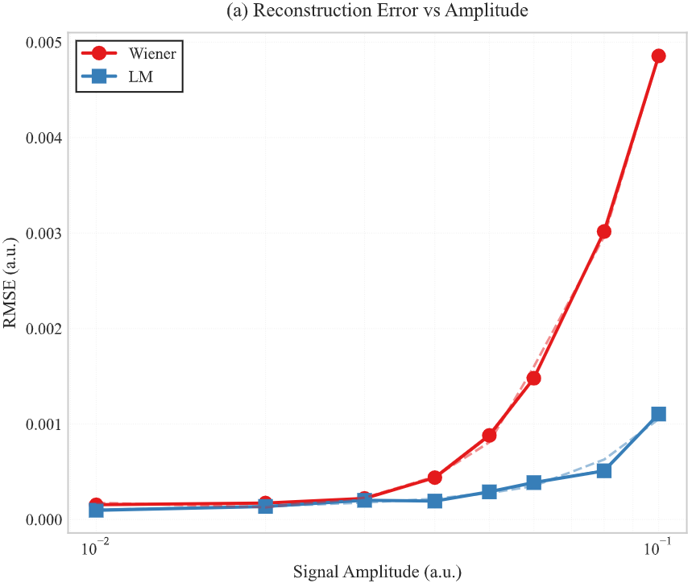
从图中可知，当幅度超过0.03时，Wiener反卷积的重建误差迅速增加，而LM优化算法的重建误差相对较小。
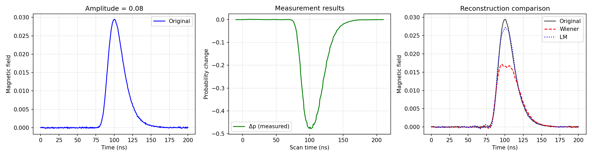
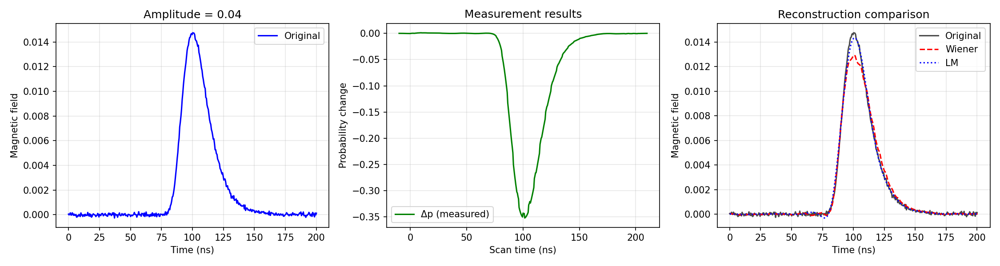
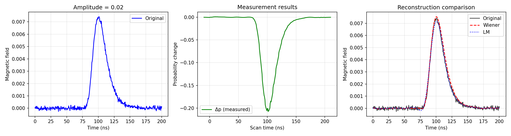
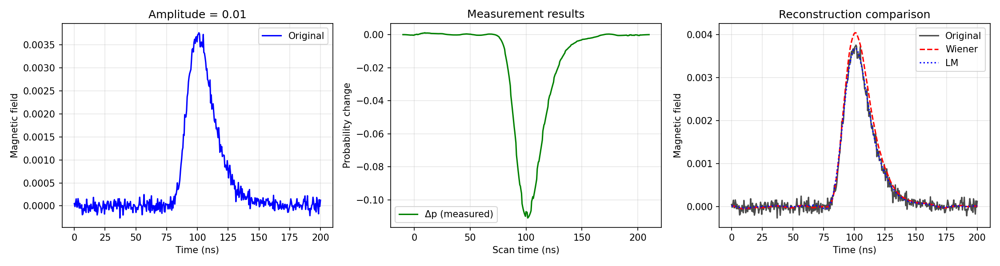
### Wiener反卷积：正则化参数lambda
lambda为10时，重建结果较好，lambda过大导致全局频率被压低，信号的高频部分也被抑制，导致重建信号展宽变宽，幅度变小，lambda过小导致高频噪声被放大，从而出现振荡
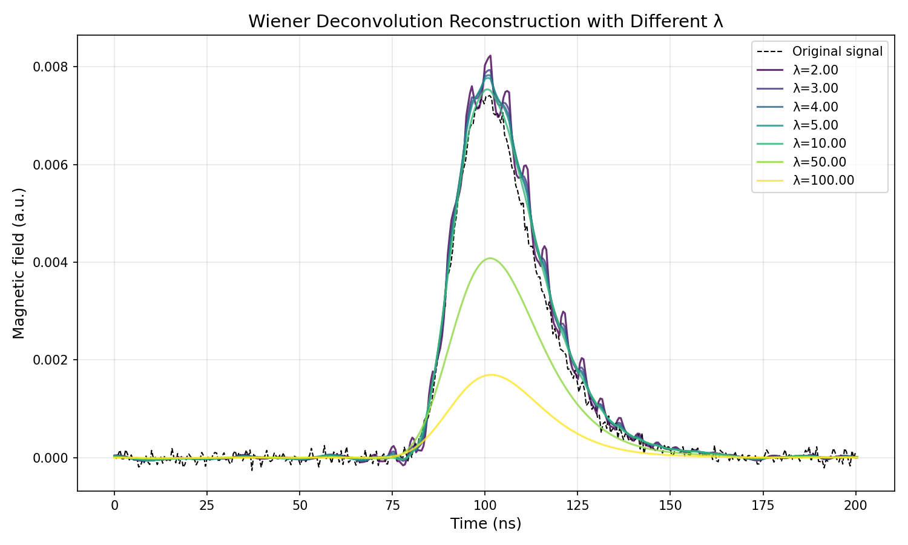

### Levenberg-Marquardt优化：正则化参数lambda
LM算法对于lambda的选择相对不敏感，因为这里的lambda主要用于高频信号的惩罚，而LM算法通过自适应调节阻尼因子，来补偿lamda选择的不当。不过，具体来看，可以看到，较小的lambda由于对高频信号惩罚不足，导致优化算法过拟合了高频噪声，从而在低频区域出现了一定的高频振荡，而较大的lambda则过度惩罚了高频信号，导致重建信号的高频部分被抑制，从而出现了展宽和幅度降低的现象。
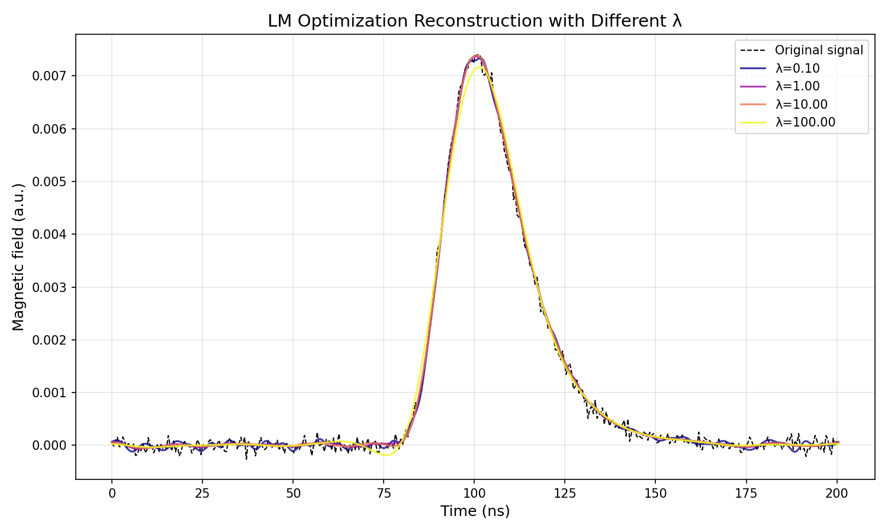

### Levenberg-Marquardt优化：迭代次数与收敛性
可以看到，残差在前几次迭代中迅速下降，之后缓慢下降，在最后收敛到0.0146。这是LM算法的典型行为，优化前期是梯度下降主导的快速下降，后期为Gauss-Newton主导的精细调整。实际应用中，发现在残差小于0.1时重建的波形已经非常接近输入信号，因此LM算法可以在预期的时间内收敛到满意的结果。
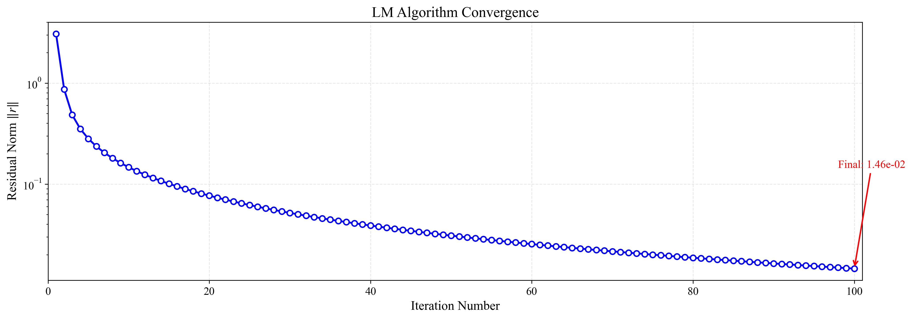
## 演化时间扫描
验证结论
### Ramsey协议
改进后的Ramsey协议可以实现对任意时变磁场的重建，但是由于重建过程依赖数值微分，因此对于噪声的耐受性较差。

重建信号的整体位移和边界效应来源于脉冲信号的宽度，当时间尺度在ns级别时，脉冲信号的宽度不能忽略。上述问题可以通过后续的数据处理来解决。
.png)
磁场信号：幅度：0.001，频率：0.001，噪声幅度：0.0001
.png)
磁场信号：幅度：0.001，频率：0.004，噪声幅度：0.0001

### 差分回波协议
差分回波协议通过施加 $k$ 对 $\pi$ 脉冲序列,由激发态概率直接反演累积相位 $\varphi = \arcsin(2p_e-1)$,再经 $B = -\varphi/(2k\kappa t_{\text{int}})$ 得到磁场。相比 Ramsey,回波序列对低频噪声与慢漂移有抑制作用。

**实现状态(2026-07-17 补)**:代码已完成 —— [`sqc/experiments/echo.py`](../sqc/experiments/echo.py) `DiffEchoExperiment`(对应旧 `Protocal(type=2)`)+ [`sqc/reconstruction/echo.py`](../sqc/reconstruction/echo.py) `EchoReconstruction`。定量重建效果并入上文"两种重建方法对比";本节独立结果图待补(**文档欠账,非功能欠账**)。

## 频谱扫描

### CPMG协议作为带通滤波器
CPMG 序列(等间隔多 $\pi$ 脉冲)的滤波函数在 $\omega \approx \pi n/\tau$ 处呈窄带通,可用于对特定频率的时变磁场做频谱选择性测量;理论见 [`_sensing theory.md`](./_sensing%20theory.md) §3。

**实现状态(2026-07-17 补)**:**未实现** —— 旧 `Protocal(type=3)` 仅为 `pass` stub;`sqc/experiments/` 中尚无对应 CPMG 实验/重建。列为 post-v1 扩展,见 [`_TODO_master.md`](./_TODO_master.md) 4.3 与 [`../RELEASE_TODO.md`](../RELEASE_TODO.md)。

## 其他实现

[Transmon qubit能级的数值求解，单比特门，两比特门](../note/Numerical%20calculation.ipynb)

## TODO
- 在重构项目中：
    - ***tomo，pi补偿，delay Ramsey（待修正） 
    - ***qubit标定，预失真
    - 核函数扩展适配，修正脉冲期间的相位积累
    - 扩展Ramsey协议，支持相位unwrap(IQ调制)，
    - 基函数比较：Fourier，B-spline，Legendre
    - [差分回波协议](./_sensing%20theory.md)
    - [CPMG协议作为带通滤波器](./_sensing%20theory.md)
    - tomo
    - 加噪声，加耗散
    - 并行优化，代码结构优化：
        - 统一时间轴t_global， *统一时间间隔，优化函数接口与扩展性
        - workflow控制台设计，支持不同任务编排
        - *全局统一t_rabi
        - *超导量子比特的实际架构：参考Practical Guide for Building Superconducting Quantum Devices
    - demo
    - 当脉冲时间不可忽略时，完善以上协议

- 研究量子传感协议，是为了探索以下几种应用：
    - 高灵敏高分辨磁场传感
    - calibration：qubit频率
    - 波形矫正：predistortion

实际的calibration包含从qubit频率标定，单比特门标定，读出标定，多比特门标定等单向依赖的多个步骤，可包含在一个自适应的DAG图中。本项目主要关注单比特门标定前的标定工作，包括qubit频率标定和波形矫正。

qubit频率标定有两种，一种是标定$f(\Phi)$曲线，一种是在确定工作点后标定频率$f_{01}$

瞬态磁场协议的应用：
- qubit频率标定（不太适用，推导？）
- 预失真标定（适用，推导？）

# 频率标定仿真
## 频率测量比较
### flux=0.0
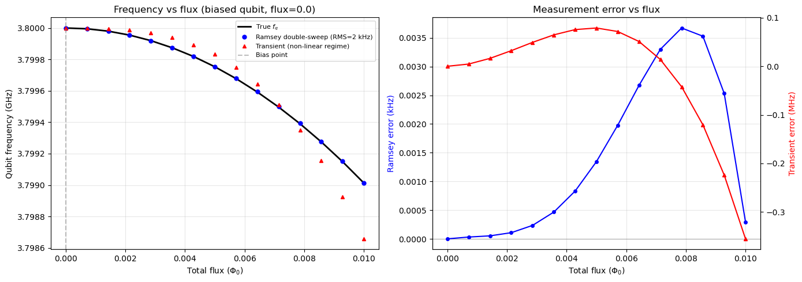
### flux=0.9
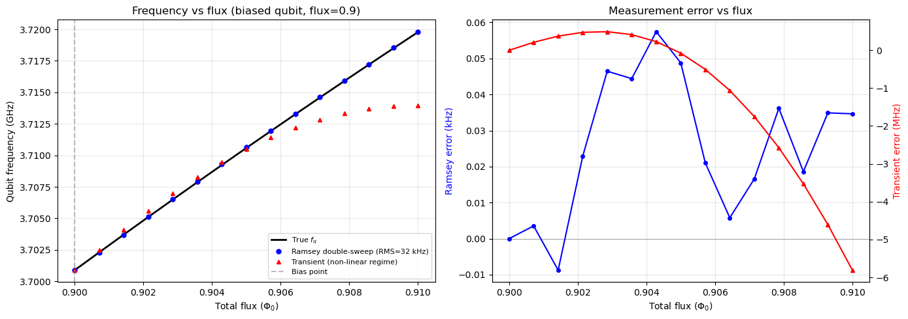

- 精度提高的方法
    - 用高斯stim求一阶核函数还是有一定误差，可以用virtual Z模拟理想delta函数，减小误差
    - QSL方法中做了很多线性近似，例如核函数只近似到一阶，从而概率的线性近似为
$
\Delta p = G \Delta 
$
    其中$G$为核函数的积分，实际上，核函数可以有高阶项，则$\Delta p$可以写成$\Delta $的任意奇数阶展开，可以发展多阶核函数理论以提高精度。不走核函数路线，直接拟合$\Delta p$也可以
        - 不过拟合也有上限，如图，$\Delta p$的变换并非单调函数，因此当$\Delta$较大时，可能存在多个解，这时可能需要进行unwrap，或者增加一些先验知识来选择合适的解
        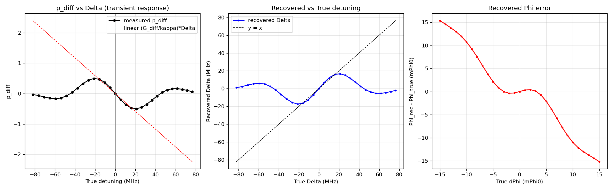

    - 对于优化qubit频率至特定频率这个具体的应用场景，还可以采用动态改$\omega_d$，采用双变量并行优化的方法，即在每次迭代中同时更新$\omega_d$和flux$，从而更快地收敛到目标频率。
    - transient测频方法在不同的flux bias的delta omega符号问题需要修正

## 核函数阶数和计算方法优化
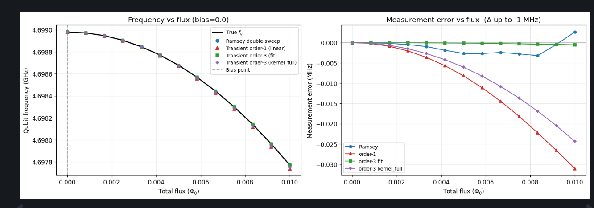
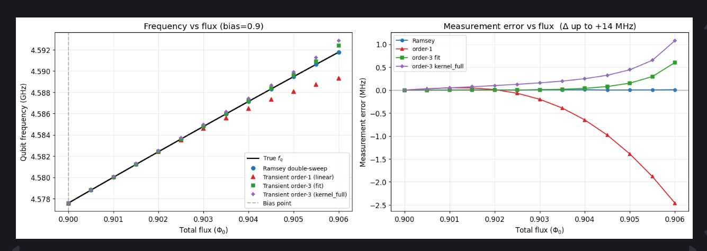
### 优化方法
- 计算核函数时，考虑高阶项：
    - 用Heisenberg模拟计算高阶核函数，虽然计算量较大，但可以得到更准确的核函数，从而提高频率测量的精度
    - 拟合$\Delta p$，直接拟合$\Delta p$相对于$\Delta$的关系，可以捕捉到非线性关系，从而提高频率测量的精度
    - Virtual Z采样
- 用virtual Z模拟理想delta函数，此时核函数与频率的关系更直接，不需要先通过磁通响应函数转换
- $\Delta p $和$\Delta$的关系可能存在非单调性，因此可以考虑一些方法来增加线性区间，例如：
    - 采用更短的$\pi/2$脉冲，虽然会降低信噪比，但可以增加线性区间
    - 采用多阶核函数理论，捕捉更多的非线性关系，从而增加线性区间
    - 采用动态调整$\omega_d$的方法，实时调整驱动频率，使得$\Delta$始终保持在较小的范围内，从而增加线性区间
## 闭环反馈演示
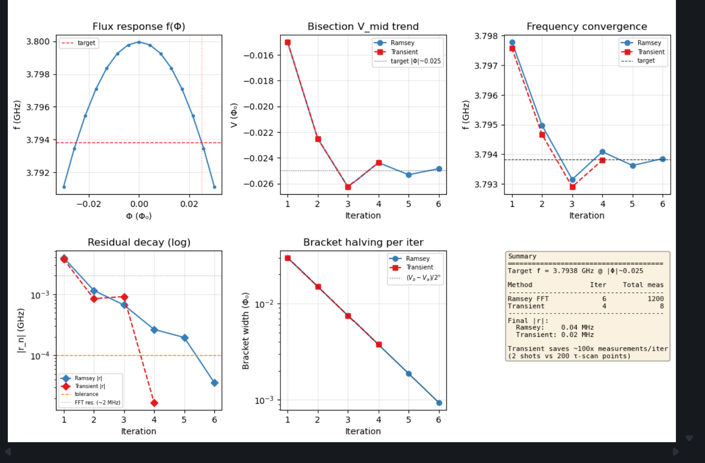
## 混合方案
从上面的闭环反馈方法中可以看到，QSL方法可以快速接近目标频率，但是精度有限。因此可以考虑在误差较大时使用QSL方法快速接近目标频率，在误差较小时使用Ramsey方法进行精细调整，从而实现快速且高精度的频率标定。
# 预失真仿真
## 失真波形探测
### Chevron 实验
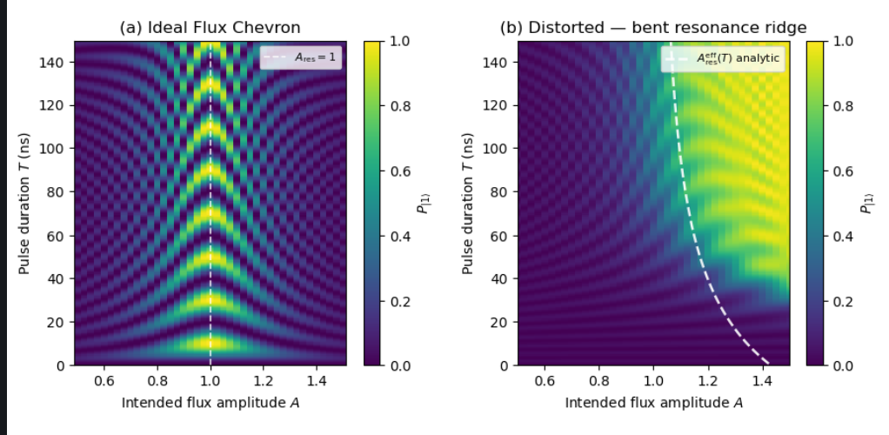
理想情况下，flux没有失真，则给定驱动频率，Rabi实验激发态的峰值出现在失谐为零的位置不变。

而当存在失真时，flux可能需要一定时间才能达到目标幅度，共振条件不在是严格的失谐为零，导致flux的峰值偏移，形成Chevron图案的扭曲。
## 失真波形测量
### pi脉冲补偿法
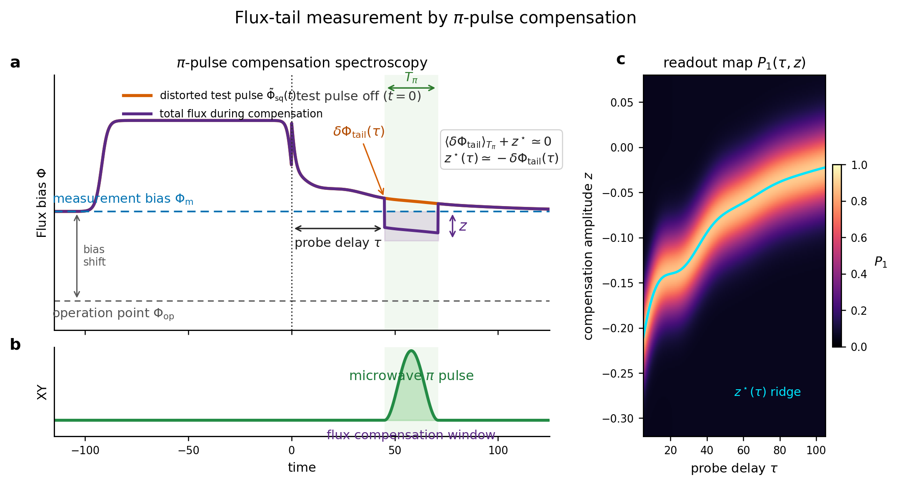
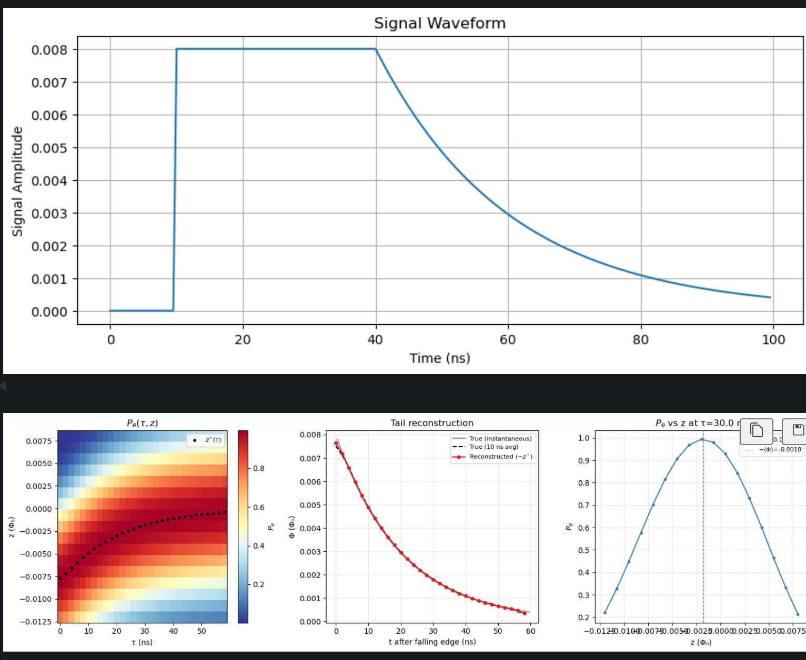
### Ramsey
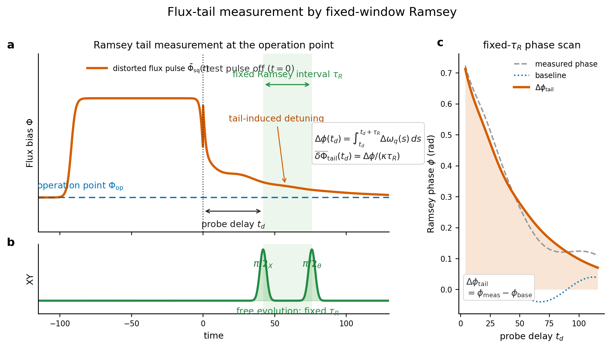
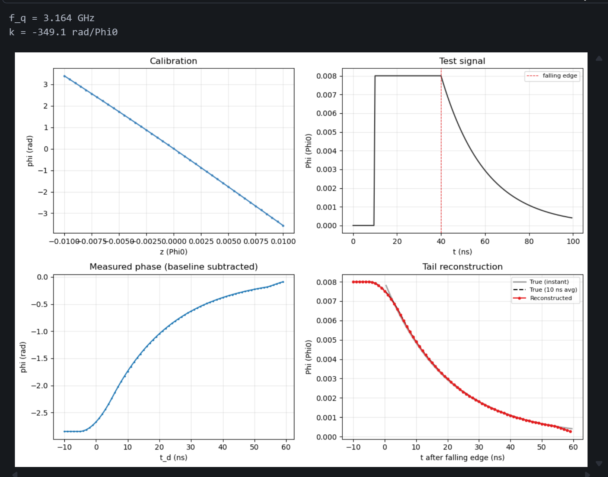
### cryoscope
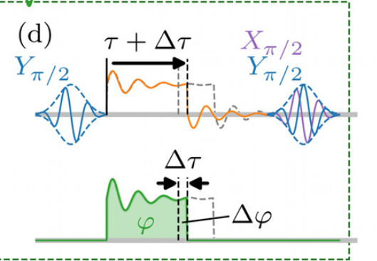
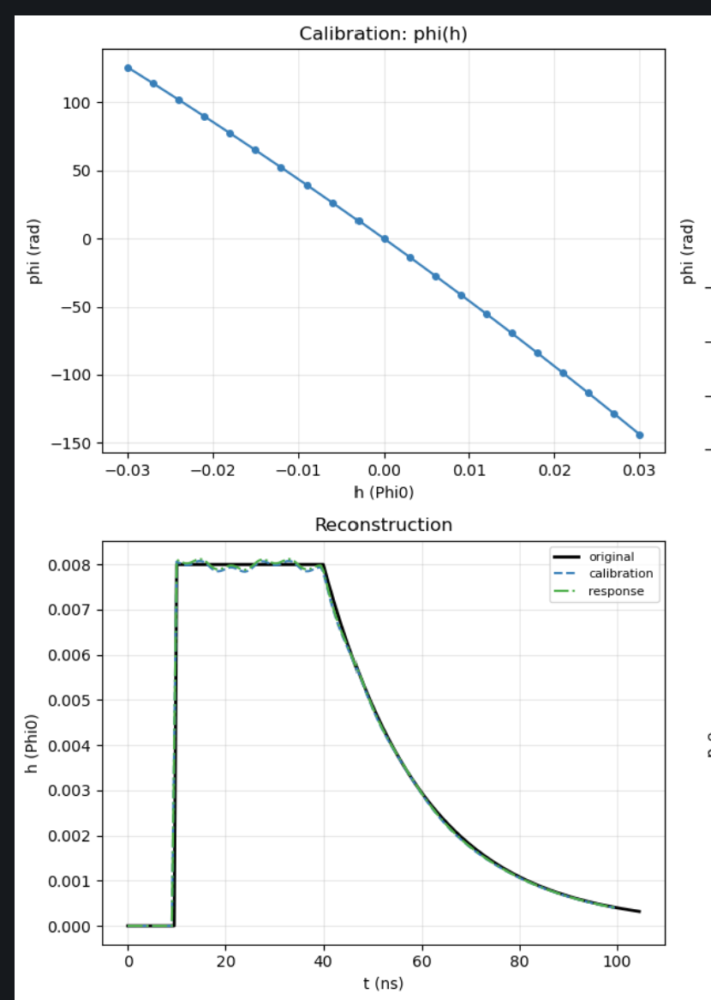
cryoscope是作差分，因此对高频变化的表征更好
### QSL
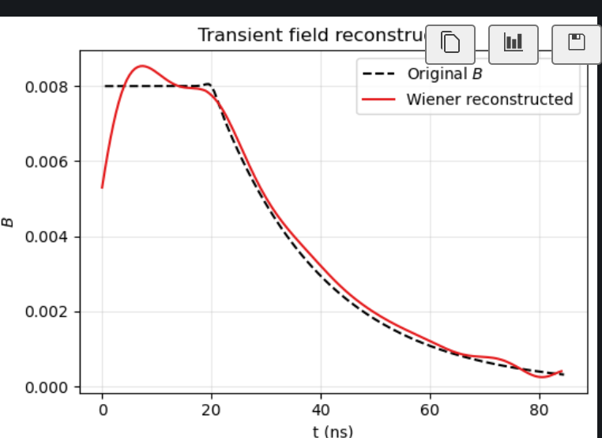

## 滤波器设计与验证
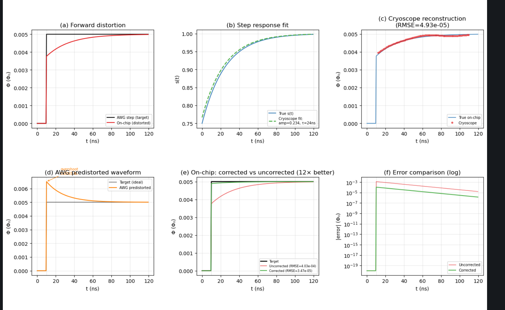