# 量子传感协议理论补充

对于磁通可调Transmon qubit，其频率随刺痛的响应函数可以写为
$$
\omega_{01}(\Phi) = \sqrt{8E_C E_J(\Phi)} - E_C
,/ ,/ ,/ ,
E_D(\Phi) = E_{J0} \cos(\pi \Phi / \Phi_0)
$$
在工作点$\Phi_w$处对其做展开，得到
$$
\omega_{01}(\Phi) \approx \omega_{01}(\Phi_w) + \left. \frac{d\omega_{01}}{d\Phi} \right|_{\Phi_w} (\Phi - \Phi_w) + \frac{1}{2} \left. \frac{d^2\omega_{01}}{d\Phi^2} \right|_{\Phi_w} (\Phi - \Phi_w)^2 + ...
$$
取一阶近似，得到
$$
\delta \omega = \omega_{01}(\Phi) - \omega_{01}(\Phi_w) \approx \kappa_{\Phi} \delta \Phi
$$
其中$\kappa_{\Phi} = \left. \frac{d\omega_{01}}{d\Phi} \right|_{\Phi_w}$是频率对磁通的灵敏度。

在旋转系下，考虑RWA近似，则系统哈密顿量可以写为
$$
H(t) = \frac{1}{2} \delta \omega(t) \sigma_z + H_{ctrl}(t)
$$
其中$H_{ctrl}(t)$是控制哈密顿量，包含了我们施加的脉冲，在自由演化时，控制哈密顿量为零。对于不同的协议，$H_{ctrl}(t)$的形式不同。控制脉冲包含$\pi/2$脉冲和$\pi$脉冲，其中$\pi/2$脉冲的作用是将量子态从$|0\rangle$旋转到$|+\rangle$（或其他方向），其通常作用在脉冲序列的开始或结尾，用于将初态制备为叠加态，或将末态投影到测量态，得到积累的相位信息，$\pi$脉冲的作用是将量子态从$|+\rangle$旋转到$|-\rangle$（或其他方向），其会将已经积累的相位变换为负值，并在后续演化中以变换后的相反方向继续积累相位。

通过以上的描述，可以得到自由演化过程积累的相位可以写为
$$
\phi = \int_0^{T}y(t)\delta \omega(t) dt
$$
其中$y(t)$是调制函数，取决于我们施加的控制脉冲序列。

演化末态可以写为
$$
\ket{\psi} = \frac{1}{\sqrt{2}} (|0\rangle + e^{i\phi} |1\rangle)
$$
施加$y-\pi/2$脉冲，测量得到的激发态概率为
$$
P_e = \frac{1}{2} (1 - \cos\phi)
$$


## Ramsey干涉
在Ramsey干涉协议中，$y(t) = 1$，时间范围为0到T，对其作fourier变换，得到频域的调制函数为因此积累的相位为
$$
Y(\omega) = \int_0^T y(t) e^{-i\omega t} dt = e^{-i\omega T/2} \frac{\sin(\omega T/2)}{\omega/2}
$$
根据频域函数，可以看到$Y(0) = T$最大，且第一个零点出现在$\omega = 2\pi/T$，因此Ramsey干涉协议中，测量时间越长， 带宽越窄，但是对低频信号响应强度更大。

积累的相位为
$$
\phi_{Ramsey} = \int_0^{T} \delta \omega(t) dt
$$
通过改变演化时间$T$，得到激发态概率随演化时间的关系，从而可以拟合得到相位关于演化时间的关系，随后对相位进行数值微分，可以得到给定时刻的频率偏移$\delta \omega$，进而得到磁场的瞬时值。

如果磁场信号是一个恒定信号，则可以直接对概率曲线进行拟合。但是如果磁场随时间变化，则需要先还原出相位曲线，但是由于概率曲线是一个周期函数，因此理论上的还原出的相位曲线是一个多值函数，因此需要保证相位足够小，使其能落入主值区域，例如缩短演化时间。或者对相位进行unwrap。

另外，对phi进行数值微分会引入额外噪声，因此在实际操作中，可能需要对phi进行平滑处理，或者直接对概率曲线进行拟合，得到一个关于时间的函数，然后对这个函数进行微分，得到频率偏移。

## Spin Echo
在Spin Echo协议中，$y(t)$是一个分段函数，在前半段为1，在后半段为-1，作fourier变换，得到频域的调制函数为
$$
Y(\omega) = \int_0^T y(t) e^{-i\omega t} dt = e^{i\omega T/2} \frac{i\sin^2(\omega T/4)}{\omega/4}
$$
根据频域函数，可以看到$Y(0) = 0, |Y(2\pi/T)| = \frac{T}{4\pi}$，因此Spin Echo协议中，低频分量被抑制，而对频率为$2\pi/T$的分量响应较强。
因此积累的相位为
$$
\phi(T = 2\tau) = \int_0^{\tau} \delta \omega(t) dt - \int_{\tau}^{2\tau} \delta \omega(t) dt
$$

根据相位定义，可以看到当磁场为0时， 相位为0，因此Spin Echo协议可以抵消掉慢变的噪声，从而提高对快速变化的信号的灵敏度。

spin echo 主要用于测量ac磁场，如$\kappa\Phi = A\cos(\omega t + \varphi)$，代入相位表达式，得到
$$
\phi = \int_0^{\tau} A\cos(\omega t + \varphi) dt - \int_{\tau}^{2\tau} A\cos(\omega t + \varphi) dt = \frac{4A}{\omega} \sin^2(\frac{\omega \tau}{2}) \sin(\omega \tau + \varphi)
$$
概率函数满足
$$
p(T) = \frac{1}{2} (1 - C\cos\phi + \phi_0) \
$$
若磁场信号频率已知，则可以将取$\tau\approx \frac{\pi}{\omega}$，此时echo对于频率的响应最大，随后固定$\tau$，通过扫描分析脉冲的相位$\phi_0$，可以得到概率关于$\phi_0$的函数。从而还原出相位$\phi$。

若磁场频率未知，则需要扫描$\tau$，随后扫描$\phi_0$，还原得到$\phi$关于$\tau$的函数，取峰值点未知，得到对应的最大响应$\tau$，从而重复上述过程，得到磁场频率的估计值。

## CPMG协议
在CPMG协议中，$y(t)$是一个分段函数，设第$j$个$\pi$脉冲的时间为$t_j = (j - \frac{1}{2})\tau, t_0 = 0, j = 1,2,...,N, N \geq 2$，则在$t_{2k}$和$t_{2k+1}$区间内，$y(t) = 1$，作fourier变换，得到频域的调制函数为
$$
\begin{aligned}
Y(\omega) &= \int_0^T y(t) e^{-i\omega t} dt \\  &= \sum_{k = 0}^{[(N+1)/2]-1}\int_{t_{2k}}^{t_{2k+1}} e^{-i\omega t} dt - \sum_{k = 0}^{[N/2]-1}\int_{t_{2k+1}}^{t_{2k+2}} e^{-i\omega t} dt \\ &= \frac{1}{i\omega} \left( 1 + (-1)^{N+1} e^{-i\omega T} + 2\sum_{k = 1}^{[N/2]} (-1)^k e^{-i\omega t_k} \right)
\end{aligned}
$$
则主响应峰在$\omega = \frac{\pi}{\tau}$，缝宽为$\frac{2\pi}{\tau}$，$\omega = 0$时，频域函数为0。则CPMG通过增加N，使得主响应峰更尖锐，从而提高对特定频率信号的灵敏度，同时抑制掉更多的低频噪声。相较于spinecho，其可以实现在中心频率不变的情况下，尽可能地缩短带宽。

若待测磁场为AC信号，同样可以计算计算出积累的相位为
$$
\phi = \int_0^T y(t) A\cos(\omega t + \varphi) dt 
$$

在实际测量时，若磁场频率已知，则取$\tau \approx \frac{\pi}{\omega}$，$N$取足够大，随后扫描分析脉冲的相位$\phi_0$，得到概率关于$\phi_0$的函数，从而还原出相位$\phi$。

若磁场为任意信号，对其做fourier展开，得到
$$
B(t) = \sum_{n = -\infty}^{+\infty} A_n \cos(\omega_n t + \varphi_n)
$$


基于上述傅里叶展开，CPMG协议可通过改变脉冲间隔 $\tau$ 实现对不同频率分量的选择性测量，从而重建磁场时域信号。

### 1. CPMG作为可调谐带通滤波器

CPMG序列的调制函数 $y_\tau(t)$ 在频域的响应 $Y_\tau(\omega)$ 具有带通特性，其中心频率 $\omega_c$ 与脉冲间隔 $\tau$ 满足：
$$
\omega_c = \frac{\pi}{\tau}
$$
当 $\tau$ 变化时，带通滤波器的中心频率随之移动。

对于包含多频率分量的磁场 $B(t) = \sum_n A_n \cos(\omega_n t + \varphi_n)$，积累的相位为：
$$
\phi(\tau) = \int_0^T y_\tau(t) B(t) dt = \sum_n A_n \int_0^T y_\tau(t) \cos(\omega_n t + \varphi_n) dt
$$
定义复响应函数：
$$
\tilde{Y}_\tau(\omega) = \int_0^T y_\tau(t) e^{-i\omega t} dt
$$
其实部对应余弦分量的响应。相位可表达为：
$$
\phi(\tau) = \sum_n A_n |\tilde{Y}_\tau(\omega_n)| \cos\left(\varphi_n + \arg\tilde{Y}_\tau(\omega_n)\right)
$$
因此，对于每个固定的 $\tau$，测量得到的相位 $\phi(\tau)$ 是各频率分量经 $Y_\tau(\omega)$ 加权滤波后的叠加。

### 2. 频率扫描采样

通过系统性地改变 $\tau$，可以获得磁场频谱的采样值。设扫描的 $\tau$ 序列为 $\{\tau_1, \tau_2, \dots, \tau_M\}$，对应的中心频率为 $\{\omega_{c1}, \omega_{c2}, \dots, \omega_{cM}\}$，其中 $\omega_{cj} = \pi/\tau_j$。

测量得到相位序列 $\phi(\tau_j)$，近似满足：
$$
\phi(\tau_j) \approx \sum_n A_n Y_{\tau_j}(\omega_n) \cos(\varphi_n + \delta_{jn})
$$
其中 $\delta_{jn} = \arg Y_{\tau_j}(\omega_n)$。

### 3. 磁场重建算法

重建磁场时域信号可视为解卷积问题。下面给出详细的数学框架和算法步骤，可直接用于代码实现。

#### 3.1 离散化与频率网格

将连续频谱离散化为 $N_f$ 个频率分量。设频率网格为 $\{\omega_1, \omega_2, \dots, \omega_{N_f}\}$，其范围由 $\tau$ 扫描范围决定：

- 最低频率：$\omega_{\min} = \pi / \tau_{\max}$
- 最高频率：$\omega_{\max} = \pi / \tau_{\min}$

频率点数 $N_f$ 的选择需权衡分辨率与计算复杂度，通常 $N_f \geq M$（$M$ 为 $\tau$ 采样点数）。可采用线性或对数间隔：

**线性网格**（适用于均匀带宽）：
$$
\omega_n = \omega_{\min} + \frac{n-1}{N_f-1}(\omega_{\max} - \omega_{\min}), \quad n=1,\dots,N_f
$$

**对数网格**（适用于宽频带测量）：
$$
\omega_n = \exp\left(\ln\omega_{\min} + \frac{n-1}{N_f-1}(\ln\omega_{\max} - \ln\omega_{\min})\right)
$$

#### 3.2 响应矩阵构建

对于每个 $\tau_j$ 和 $\omega_n$，计算 CPMG 调制函数的傅里叶变换值。根据前文推导，CPMG 序列的频域响应函数为：

$$
Y_\tau(\omega) = \frac{1}{i\omega} \left( 1 + (-1)^{N+1} e^{-i\omega T} + 2\sum_{k=1}^{[N/2]} (-1)^k e^{-i\omega t_k} \right)
$$

其中 $t_k = (k-1/2)\tau$，$T = N\tau$，$N$ 为 $\pi$ 脉冲数。

**响应矩阵 $\mathbf{Y} \in \mathbb{C}^{M \times N_f}$** 的元素定义为：
$$
Y_{jn} = Y_{\tau_j}(\omega_n), \quad j=1,\dots,M; \ n=1,\dots,N_f
$$

由于测量相位 $\phi(\tau_j)$ 是实数，实际参与运算的是 $\mathbf{Y}$ 的实部。定义 **实响应矩阵 $\mathbf{Y}_r = \Re\{\mathbf{Y}\}$**。

#### 3.3 线性系统建模

设复频谱向量 $\mathbf{a} \in \mathbb{C}^{N_f}$，其中 $a_n = A_n e^{i\varphi_n}$ 包含幅值 $A_n$ 和相位 $\varphi_n$。测量模型为：

$$
\boldsymbol{\phi} = \Re\{\mathbf{Y} \mathbf{a}\} + \boldsymbol{\epsilon}
$$

其中 $\boldsymbol{\phi} = [\phi(\tau_1), \dots, \phi(\tau_M)]^T \in \mathbb{R}^M$，$\boldsymbol{\epsilon} \in \mathbb{R}^M$ 为测量噪声。

将复数运算转换为实数运算：令 $\mathbf{a} = \mathbf{x} + i\mathbf{y}$，其中 $\mathbf{x}, \mathbf{y} \in \mathbb{R}^{N_f}$ 分别为实部和虚部。则：

$$
\Re\{\mathbf{Y} \mathbf{a}\} = \Re\{\mathbf{Y}\}\mathbf{x} - \Im\{\mathbf{Y}\}\mathbf{y} = \mathbf{Y}_r \mathbf{x} - \mathbf{Y}_i \mathbf{y}
$$

其中 $\mathbf{Y}_i = \Im\{\mathbf{Y}\}$。定义增广向量 $\mathbf{z} = [\mathbf{x}^T, \mathbf{y}^T]^T \in \mathbb{R}^{2N_f}$ 和增广矩阵 $\mathbf{\tilde{Y}} = [\mathbf{Y}_r, -\mathbf{Y}_i] \in \mathbb{R}^{M \times 2N_f}$，则线性系统简化为：

$$
\boldsymbol{\phi} = \mathbf{\tilde{Y}} \mathbf{z} + \boldsymbol{\epsilon}
$$

#### 3.4 正则化求解

直接求解 $\mathbf{z}$ 通常病态（尤其当 $M < 2N_f$ 时），需引入正则化。采用 **Tikhonov 正则化**：

$$
\hat{\mathbf{z}} = \arg\min_{\mathbf{z}} \left\{ \|\mathbf{\tilde{Y}} \mathbf{z} - \boldsymbol{\phi}\|_2^2 + \lambda \|\mathbf{z}\|_2^2 \right\}
$$

其中 $\lambda > 0$ 为正则化参数。该优化问题的解析解为：

$$
\hat{\mathbf{z}} = (\mathbf{\tilde{Y}}^T \mathbf{\tilde{Y}} + \lambda \mathbf{I})^{-1} \mathbf{\tilde{Y}}^T \boldsymbol{\phi}
$$

**正则化参数选择**：
- **交叉验证**：将数据分为训练集和验证集，选择使验证误差最小的 $\lambda$
- **L-曲线法**：绘制 $\|\mathbf{\tilde{Y}}\mathbf{z}-\boldsymbol{\phi}\|$ 与 $\|\mathbf{z}\|$ 的关系曲线，选择拐点处的 $\lambda$
- **经验公式**：$\lambda = \sigma^2 / \|\mathbf{a}_{\text{prior}}\|^2$，其中 $\sigma^2$ 为噪声方差，$\|\mathbf{a}_{\text{prior}}\|^2$ 为先验信号能量估计

#### 3.5 频谱与时域重建

从 $\hat{\mathbf{z}} = [\hat{\mathbf{x}}^T, \hat{\mathbf{y}}^T]^T$ 恢复复频谱：
$$
\hat{a}_n = \hat{x}_n + i\hat{y}_n, \quad n=1,\dots,N_f
$$

幅值和相位分别为：
$$
\hat{A}_n = |\hat{a}_n|, \quad \hat{\varphi}_n = \arg(\hat{a}_n)
$$

重建的时域磁场信号为：
$$
\hat{B}(t) = \sum_{n=1}^{N_f} \hat{A}_n \cos(\omega_n t + \hat{\varphi}_n)
$$

#### 3.6 算法步骤总结

1. **数据采集**：
   - 扫描 $\tau$ 序列 $\{\tau_1, \dots, \tau_M\}$
   - 对每个 $\tau_j$，通过双点测量（分析脉冲相位 $\phi_0=0$ 和 $\pi/2$）得到 $\phi(\tau_j)$
   - 收集测量向量 $\boldsymbol{\phi} \in \mathbb{R}^M$

2. **参数设置**：
   - 选择频率网格 $\{\omega_1, \dots, \omega_{N_f}\}$（线性或对数）
   - 设定正则化参数 $\lambda$（通过交叉验证等）
   - 确定 CPMG 脉冲数 $N$（通常固定）

3. **矩阵计算**：
   - 对每个 $(\tau_j, \omega_n)$ 计算 $Y_{\tau_j}(\omega_n)$
   - 构建复数矩阵 $\mathbf{Y} \in \mathbb{C}^{M \times N_f}$
   - 分离实部 $\mathbf{Y}_r$ 和虚部 $\mathbf{Y}_i$
   - 构造增广矩阵 $\mathbf{\tilde{Y}} = [\mathbf{Y}_r, -\mathbf{Y}_i]$

4. **求解频谱**：
   - 解正则化方程：$\hat{\mathbf{z}} = (\mathbf{\tilde{Y}}^T \mathbf{\tilde{Y}} + \lambda \mathbf{I})^{-1} \mathbf{\tilde{Y}}^T \boldsymbol{\phi}$
   - 提取 $\hat{\mathbf{x}}, \hat{\mathbf{y}}$，组合成 $\hat{\mathbf{a}} = \hat{\mathbf{x}} + i\hat{\mathbf{y}}$

5. **信号重建**：
   - 计算幅值 $\hat{A}_n = |\hat{a}_n|$ 和相位 $\hat{\varphi}_n = \arg(\hat{a}_n)$
   - 合成时域信号：$\hat{B}(t) = \sum_n \hat{A}_n \cos(\omega_n t + \hat{\varphi}_n)$

#### 3.7 伪代码示例（Python）

```python
import numpy as np
from scipy.linalg import solve

def reconstruct_magnetic_field(tau_list, phi_list, N_pulses, lambda_reg=1e-3):
    """
    从CPMG扫描数据重建磁场
    
    参数:
        tau_list: τ扫描序列 (M,)
        phi_list: 测量的相位序列 (M,)
        N_pulses: CPMG中的π脉冲数
        lambda_reg: 正则化参数
    
    返回:
        omega_grid: 频率网格 (N_f,)
        A_est: 幅值估计 (N_f,)
        phi_est: 相位估计 (N_f,)
        B_recon: 重建的时域信号函数 B(t)
    """
    M = len(tau_list)
    
    # 1. 设置频率网格
    omega_min = np.pi / max(tau_list)
    omega_max = np.pi / min(tau_list)
    N_f = min(2*M, 200)  # 频率点数，经验值
    omega_grid = np.linspace(omega_min, omega_max, N_f)
    
    # 2. 计算CPMG响应函数
    def Y_tau_omega(tau, omega, N):
        """计算Y_tau(omega)"""
        T = N * tau
        t_k = np.array([(k - 0.5) * tau for k in range(1, N//2 + 1)])
        sum_term = 2 * np.sum([(-1)**k * np.exp(-1j * omega * t_k[k-1]) 
                              for k in range(1, N//2 + 1)])
        return (1 + (-1)**(N+1) * np.exp(-1j * omega * T) + sum_term) / (1j * omega)
    
    # 3. 构建响应矩阵
    Y_complex = np.zeros((M, N_f), dtype=complex)
    for j, tau in enumerate(tau_list):
        for n, omega in enumerate(omega_grid):
            Y_complex[j, n] = Y_tau_omega(tau, omega, N_pulses)
    
    Y_real = np.real(Y_complex)
    Y_imag = np.imag(Y_complex)
    
    # 4. 构建增广系统
    Y_tilde = np.hstack([Y_real, -Y_imag])  # (M, 2N_f)
    phi_vec = np.array(phi_list).reshape(-1, 1)  # (M, 1)
    
    # 5. 正则化求解
    I = np.eye(2 * N_f)
    z_est = solve(Y_tilde.T @ Y_tilde + lambda_reg * I, Y_tilde.T @ phi_vec)
    z_est = z_est.flatten()
    
    # 6. 提取频谱
    x_est = z_est[:N_f]  # 实部
    y_est = z_est[N_f:]  # 虚部
    a_est = x_est + 1j * y_est
    
    A_est = np.abs(a_est)
    phi_est = np.angle(a_est)
    
    # 7. 定义重建函数
    def B_reconstructed(t):
        """重建的磁场时域信号"""
        return np.sum(A_est * np.cos(omega_grid * t[:, np.newaxis] + phi_est), axis=1)
    
    return omega_grid, A_est, phi_est, B_reconstructed

# 使用示例
# tau_scan = np.linspace(10, 200, 50)  # 50个τ点，10-200 ns
# phi_measured = [...]  # 实验测量的相位
# omega, A, phi, B_func = reconstruct_magnetic_field(tau_scan, phi_measured, N_pulses=4)
# t_eval = np.linspace(0, 1000, 1000)
# B_recon = B_func(t_eval)
```

#### 3.8 注意事项

1. **矩阵条件数**：响应矩阵 $\mathbf{\tilde{Y}}$ 通常病态，需确保 $\lambda$ 足够大以稳定求解
2. **频率外推**：重建仅覆盖 $[\omega_{\min}, \omega_{\max}]$ 频带，该范围外的分量无法恢复
3. **计算效率**：直接求解 $(M \times 2N_f)$ 系统复杂度为 $O((2N_f)^3)$，对于大 $N_f$ 可考虑迭代法
4. **噪声模型**：上述假设高斯白噪声，若噪声有色需采用加权正则化

### 4. 实际考虑因素

#### 4.1 频率分辨率
- 最小可分辨频率 $\Delta f_{\min} \approx 1/T$，其中 $T = N\tau$ 为总演化时间。
- 最大可测频率 $f_{\max} \approx 1/(2\tau_{\min})$，受 $\tau$ 下限限制。

#### 4.2 噪声与正则化
- 测量噪声会通过解卷积放大，需采用 Tikhonov 正则化或 Wiener 滤波。
- 正则化参数可通过交叉验证确定。

#### 4.3 $\tau$ 采样策略

$\tau$ 的选取是 CPMG 频率扫描方案的核心问题。由于 $\omega_c = \pi/\tau$ 是非线性映射，$\tau$ 的分布直接决定了频域采样的均匀性和效率。

##### 4.3.1 物理约束

$\tau$ 的取值范围受两个物理限制：

**下限 $\tau_{\min}$**：受 $\pi$ 脉冲的有限宽度 $t_\pi$ 限制。$\tau$ 必须大于 $t_\pi$，否则相邻脉冲会重叠。实际中取：
$$
\tau_{\min} \geq 2 t_\pi
$$
这决定了可测量的**最高频率**：
$$
f_{\max} = \frac{1}{2\tau_{\min}}
$$

**上限 $\tau_{\max}$**：受退相干时间 $T_2$ 限制。总序列时间 $T = N\tau$ 不能超过 $T_2$，否则信号完全衰减。对固定 $N$：
$$
\tau_{\max} \leq \frac{T_2}{N}
$$
这决定了可测量的**最低频率**：
$$
f_{\min} = \frac{1}{2\tau_{\max}}
$$

##### 4.3.2 非线性映射问题

中心频率与 $\tau$ 的关系 $\omega_c = \pi/\tau$ 是非线性的。若在 $\tau$ 域均匀采样（$\tau_j = \tau_{\min} + (j-1)\Delta\tau$），对应的频率采样为：
$$
\omega_j = \frac{\pi}{\tau_{\min} + (j-1)\Delta\tau}
$$
这导致**低频密集、高频稀疏**的非均匀频率采样，即对低频过采样而高频欠采样。

##### 4.3.3 策略一：频域均匀采样

为在频域获得均匀采样，应先选定等间隔的频率网格，再反算 $\tau$：

$$
\omega_j = \omega_{\min} + (j-1)\Delta\omega, \quad \Delta\omega = \frac{\omega_{\max} - \omega_{\min}}{M-1}
$$
$$
\tau_j = \frac{\pi}{\omega_j}
$$

其中 $M$ 为采样点数。频率分辨率 $\Delta\omega$ 需满足：
$$
\Delta\omega \leq \frac{2\pi}{T} = \frac{2\pi}{N\tau}
$$
即相邻采样频率的间距不超过 CPMG 滤波器的主瓣宽度，以避免频率遗漏。

**适用场景**：目标频率范围已知且较窄（$\omega_{\max}/\omega_{\min} < 10$）。

##### 4.3.4 策略二：对数频率采样

当目标频率范围跨多个量级时（如 $\omega_{\max}/\omega_{\min} > 10$），对数分布更高效：

$$
\omega_j = \omega_{\min} \cdot \left(\frac{\omega_{\max}}{\omega_{\min}}\right)^{(j-1)/(M-1)}
$$
$$
\tau_j = \frac{\pi}{\omega_j}
$$

对数采样使得每个频率 decade 内的采样点数大致相同，避免高频区域欠采样。

**适用场景**：宽带信号测量、先验信息不足时的初始探测。

##### 4.3.5 策略三：自适应两阶段采样

当完全缺乏先验信息时，采用**粗扫+细扫**的两阶段策略：

**第一阶段——粗扫**：用少量 $\tau$ 点（$M_1 \sim 10\text{-}20$）对数分布覆盖整个可测频率范围，获取频谱的粗略轮廓：

$$
\tau_j^{(1)} = \frac{\pi}{\omega_j^{(1)}}, \quad \omega_j^{(1)} \text{ 对数分布于 } [\omega_{\min}, \omega_{\max}]
$$

测量 $\phi(\tau_j^{(1)})$，计算频谱能量估计：
$$
S(\omega_j) \propto |\phi(\tau_j^{(1)})| \cdot \omega_j
$$
识别频谱峰值位置 $\{\omega_{p1}, \omega_{p2}, \dots\}$。

**第二阶段——细扫**：在每个峰值 $\omega_{pk}$ 周围以均匀间距密集采样：

$$
\omega_j^{(2)} \in \left[\omega_{pk} - \frac{\Delta\omega_{\text{BW}}}{2},\  \omega_{pk} + \frac{\Delta\omega_{\text{BW}}}{2}\right]
$$

其中 $\Delta\omega_{\text{BW}} = 2\pi/(N\tau_{pk})$ 为 CPMG 滤波器在 $\omega_{pk}$ 处的带宽。细扫点数 $M_2$ 应满足：

$$
M_2 \geq \frac{\Delta\omega_{\text{BW}}}{\delta\omega_{\text{target}}}
$$

$\delta\omega_{\text{target}}$ 为目标频率精度。

**适用场景**：未知信号的通用测量。

##### 4.3.6 策略四：稀疏信号的压缩感知采样

若磁场信号在频域是**稀疏**的（即仅包含 $K$ 个显著频率分量，$K \ll N_f$），可利用压缩感知理论，用远少于奈奎斯特准则要求的采样点数完成重建。

**采样方法**：在 $[\tau_{\min}, \tau_{\max}]$ 范围内**随机**选取 $M$ 个 $\tau$ 值：
$$
\tau_j \sim \text{Uniform}(\tau_{\min}, \tau_{\max}), \quad j = 1, \dots, M
$$

采样点数的下界由压缩感知理论给出：
$$
M \geq C \cdot K \cdot \log(N_f / K)
$$
其中 $C$ 为常数（通常 $C \approx 2\text{-}4$），$K$ 为信号的频域稀疏度，$N_f$ 为频率网格点数。

**重建算法**：将 Tikhonov 正则化替换为 $\ell_1$ 正则化（即 LASSO / Basis Pursuit）：
$$
\hat{\mathbf{z}} = \arg\min_{\mathbf{z}} \left\{ \|\mathbf{\tilde{Y}} \mathbf{z} - \boldsymbol{\phi}\|_2^2 + \lambda \|\mathbf{z}\|_1 \right\}
$$

$\ell_1$ 范数促进解的稀疏性，使得仅少数频率分量具有非零幅度。

**适用场景**：已知磁场由少数AC分量组成（如环境中的特定干扰源），此时可大幅减少测量次数。

##### 4.3.7 采样点数 $M$ 的选取指南

| 场景 | 推荐策略 | 最少采样点数 |
|------|----------|-------------|
| 单频AC信号 | 频域均匀，少量点 | $M \geq 3$（幅度+频率+相位） |
| 已知频率范围的多频信号 | 频域均匀 | $M \geq 2K+1$（$K$ 为频率分量数） |
| 宽带未知信号 | 自适应两阶段 | 粗扫 $\sim 15$，细扫每峰 $\sim 5\text{-}10$ |
| 稀疏信号 | 压缩感知（随机） | $M \geq 4K\log(N_f/K)$ |

#### 4.4 相位提取精度
- 需通过扫描分析脉冲相位 $\phi_0$ 精确提取 $\phi(\tau)$，方法同前：
  $$
  P_e(\phi_0) = \frac{1}{2}\left[1 - \cos(\phi(\tau) + \phi_0)\right]
  $$
  测量 $\phi_0 = 0$ 和 $\phi_0 = \pi/2$ 两点即可解出 $\phi(\tau)$。

### 5. 总结

CPMG频率扫描方案本质上是利用脉冲序列的**可调谐滤波特性**，通过改变 $\tau$ 移动带通滤波器的中心频率，从而采样磁场的频率成分。该方法适用于：
1. **未知频率的AC磁场测量**
2. **宽带磁场信号的频谱分析**
3. **时变磁场的非侵入式监测**

主要优势包括频率选择性好、抗低频噪声能力强；主要限制是频率分辨率受总演化时间 $T$ 约束，且对直流磁场不敏感。

该方案为量子磁强计提供了一种灵活的频域测量手段，可结合压缩感知等先进算法进一步提高重建效率。


## 差分回波协议
该协议采用等效采样计技术，下图描述了4中具体脉冲序列：
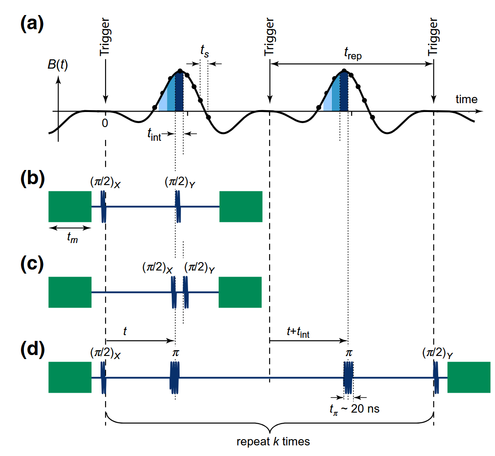
其中，纵坐标$B(t)$表示一个可重复的任意磁场信号，横坐标$t$表示相对于触发点的时间，$t_{rep}$表示两次采样之间的间隔时间，即重复时间。

b展示了标准Ramsey协议的脉冲序列，通过改变延迟时间可以得到不同的磁场从0到$\tau$的积分，对最终结果进行数值微分可以得到磁场的瞬时值。但是由于概率函数是周期函数，通过这种方法求相位会导致相位wrap，并且求导会引入额外的噪声。

c展示了一种Ramsey干涉的变形，在$t$时刻施加一个脉冲，演化一个小的时间间隔$t_{int}$后，施加另一个脉冲，在这种脉冲序列下，由于演化时间很短，于是相位可以直接写为
$$
\phi = \int_t^{t+t_{int}} \delta \omega(t') dt' \approx \kappa_{\Phi} t_{int} B(t)
$$
由此可以直接得到磁场的瞬时值，而不需要进行数值微分，同时由于相位足够小，因此不存在wrap的问题。但是由于间隔时间短，因此积累的相位较小，测量结果的信噪比较低，灵敏度较低。

d展示了差分回波协议的脉冲序列，在初始时施加一个$\pi/2$脉冲，随后在$t$时刻施加一个$\pi$脉冲，待信号结束，再次触发，产生信号，随后在$t+t_{int}$时刻施加另一个$\pi$脉冲，重复$k$上述过程，最后施加一个$\pi/2$脉冲。

以上的序列可以统一用一个调制函数$M(t, t')$描述，$t$表示采样延迟，即当前想要测量的磁场信号的时间点，相位可以写为
$$
\phi = k\int_{0}^{2t_{rep}} M(t, t') \delta \omega(t') dt' = k\int_{0}^{t_{rep}}( M_1(t, t') + M_2(t, t') ) \kappa_{\Phi} B(t') dt'
$$
其中考虑了磁场的可重复性。上式中，$M_1 + M_2$的作用等价于图c脉冲的作用。则
$$
\phi = -2k\kappa_{\Phi} t_{int} B(t)
$$

上式通过一个脉冲序列，自动实现了对磁场的微分，从而直接得到磁场的瞬时值，同时由于积累了$k$次相位，因此可以提高信噪比，提升灵敏度。


## Walsh协议

## 瞬态磁场协议
瞬态磁场测量通过两个连续的$\pi/2$脉冲实现，通过计算脉冲序列的核函数，可以突破脉冲宽度的分辨率限制。
## cryoscope协议
cryoscope将qubit作为片上示波器，可以达到脉冲宽度的分辨率。

cryoscope使用标准的Ramsey框架，并在两个脉冲之间插入一个可被截断的flux脉冲，通过测得的flux脉冲积累的相位，从而反推出磁通波形。

首先应该进行频率-磁通的标定，理论上，频率磁通响应函数为
$$
f(\Phi) = \sqrt{8E_C E_J |\cos(\pi \Phi/\Phi_0)|} - E_C
$$
在工作点甜点附近，可以近似为二次函数：
$$
\Delta f(\Phi) = f(\Phi) - f(\Phi_{w}) = \alpha \Phi^2
$$
具体标定过程如下：

首先将qubit偏置到甜点，设定脉冲序列为标准Ramsey序列$\pi/2 - \tau - \pi/2$，其中$\tau$固定，并在演化器件施加一个固定宽度$T$的flux脉冲，扫描脉冲的高度$h$，获取Ramsey干涉的激发概率$P_e(h)$，反推得到相位标定曲线$\phi(h)$。

随后测量待测flux脉冲。施加与标定过程相同的脉冲序列，在第一段$\pi/2$脉冲结束后trigger一个待测脉冲，并在$t_{trunc}$处截断，改变第二段脉冲的旋转轴为X和Y，分别提取出概率$p_x$和$p_y$，计算相应的三角函数值$\braket{X} = \cos\phi, \braket{Y} = \sin\phi$。

随后进行数据处理。由于相位可能变化超过$2\pi$导致wrap问题，需要对$\braket{X}$和$\braket{Y}$进行额外处理。首先对$\braket{X} + i\braket{Y}$进行傅里叶变换，得到最高幅度的频率分量$f_p$，即为flux脉冲的平均失谐。做变频$$\braket{X} + i\braket{Y} \to (\braket{X} + i\braket{Y}) e^{-2\pi i f_p t}$$
解调之后的频率分量相对较低，基本不会出现wrap问题，可以直接通过反正切函数得到相位：
$$
\phi_d = \arctan\left(\frac{\braket{Y}_d}{\braket{X}_d}\right)
$$
总相位为
$$
\phi = \phi_d + 2\pi f_p t_{trunc}
$$
得到相位后，进行数值微分，得到频率：
$$
\Delta f(t) = \frac{1}{2\pi} \frac{d\phi}{dt}
$$
微分步长通常为扫描步长，亦等于AWG的采样率。不过为了消除噪声影响，求导前通常会对相位进行平滑处理，常用的方法是Savitzky-Golay滤波器。

随后根据标定曲线即可得到磁通波形。


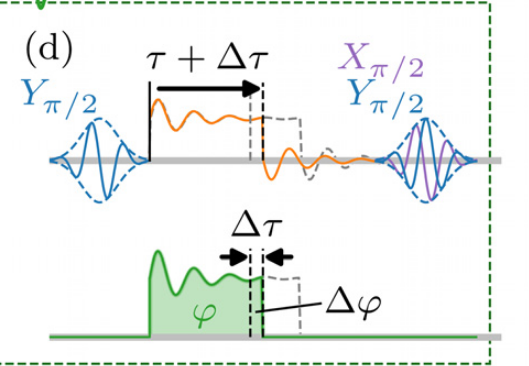


以下两种方法主要用于测量方波脉冲的拖尾，用于波形的预失真。
## $\pi$脉冲补偿法

上图是$\pi$脉冲补偿法的示意图。

该方法需要在磁通敏感点上进行测量，因此首先需要将工作点偏置到磁通敏感点附近，然后通过AWG施加一个方波，由于波形失真，到达qubit的flux会有一个上升沿和下降沿，假设两者对称，因此只测下降沿。

设方波关断指令时刻为时间零点，偏置点为$\Phi_m$，到达qubit的真实磁通为$\tilde{\Phi}_{sq}(t)$。在$\tau$时刻施加一个宽度为$T_{\pi}$，高度为$z$的flux补偿，因此qubit实际感受到的磁通为
$$
\Phi_{total}(t) = \tilde{\Phi}_{sq}(t) + z(t)
$$
补偿条件写为
$$
\braket{\Phi_{total}} = \Phi_m
$$
则拖尾和补偿的关系为
$$
z^*(t) = -\frac{1}{T_\pi}\int_t^{t+T_\pi} \tilde{\Phi}_{sq}(t') dt' + \Phi_m 
$$

与补偿flux相同的时间窗口上施加一个pi脉冲，脉冲驱动频率为$\omega_d = \omega_q(\Phi_m)$，若补偿可以抵消拖尾，则qubit共振，态翻转到激发态。

扫描$\tau$和$z$，每次得到相应的激发概率$P_e(\tau, z)$，则$\tau,z$对应的$p_e$最大值即为最佳的$z(\tau)$，提取之，即得到拖尾近似满足的波形。如图c，若将亮线翻转，即为拖尾波形。

由于实验需要找共振峰，而$\pi$脉冲带宽约为$\frac{1}{T_\pi}$，则$\kappa \Phi_{tail}$至少要大于$\frac{1}{T_\pi}$，才能保证共振峰的存在，因此需要偏置到磁通敏感点附近，以保证足够的频率响应。

### 性能分析
由于补偿条件是对一个时间窗口的平均，因此该方法存在一个时间分辨率限制$T_\pi$，另外该方法要求对qubit进行偏置，且偏置点的频率必须测量，以施加正确频率的$\pi$脉冲。测量涉及二维扫描，每个扫描点又需要进行多次重复测量以获得统计结果，因此该方法的测量时间较长，且对环境变化较为敏感。

## delay Ramsey

上图是Ramsey tomo方法的示意图。

该方法相对$\pi$脉冲补偿法来说，不需要对qubit偏置点频率进行标定测量。也不需要flux补偿。

设方波关断指令时刻为时间零点，在$t_d$时刻，施加一个演化时间为$\tau_R$的Ramsey脉冲，驱动频率为$\omega_d = \omega_q(\Phi_b)$，$\pi/2$脉冲宽度为$T_{\pi/2}$，做正交测量，得到$P_x$和$P_y$，计算得到相位
$$
\phi = \arctan\left(\frac{P_y}{P_x}\right)
$$

扫描$t_d$，得到相位$\phi(t_d)$，

不施加方波，重复上述实验，得到baseline相位$\phi_{base}$，则拖尾引入的相位为
$$
\phi_{tail}(t_d) = \phi - \phi_{base} = \int_{t_d}^{t_d+\tau_R} \delta \omega(t) dt
$$
由此得到拖尾和相位的关系为
$$
\braket{\Phi_{tail}} = \int_{t_d}^{t_d+\tau_R} \Phi_{tail}(t) dt = \frac{\phi_{tail}}{\tau_R \kappa_{\Phi_b}}
$$

随后做相位标定，在baseline下，在Ramsey序列的自由演化阶段施加一个高度为$z$的flux，进行Ramsey实验得到相位$\phi_{cal}(z)$，相位满足
$$
\phi_{cal}(z) = \tau_R \kappa_{\Phi_b} z
$$

扫描$z$，得到标定曲线$\phi_{cal}(z)$，拟合斜率$k = \frac{d\phi_{cal}}{dz} = \tau_R \kappa_{\Phi_b}$

则拖尾的磁通可以由标定相位得到：
$$
\Phi_{tail}(t_d) = \phi_{cal}^{-1}(\phi_{tail}(t_d)) = \frac{\phi_{tail}(t_d)}{k}
$$

# 应用
量子传感中涉及的各种协议可以用于量子计算中的calibration和脉冲矫正。下面分析以上各协议在qubit频率标定和信号预失真的应用。

## qubit频率标定
qubit频率标定可以根据需求和应用场景分为很多种方式：
- 当qubit首次启动时，需要进行批量qubit串扰标定
- 在使用过程中，需要长期自动进行qubit频率标定，以应对环境变化引起的频率漂移，涉及闭环反馈控制
- 某次使用时，需要进行快速的精细校准或测量，把qubit校准到指定频率点上，或测量qubit频率，作为后续操作的参考。
- 为了校准qubit的频率磁通响应

下面，先介绍一个标定的总体DAG框架，在根据应用场景进行分析，最后分析当前协议在这些应用场景中的适用性和优势。

### DAG框架
[Kelly 2018:Physical Qubit Calibration on a Directed Acyclic Graph]("C:\Users\21034\Desktop\Workspace\scholaraio\data\libraries\papers\Kelly-2018-Physical-qubit-calibration-on-a-directed-acyclic-graph")

建立了一个全自动的qubit校准框架，使用DAG（Directed Acyclic Graph）来描述校准流程中的依赖关系。每个节点代表一个校准步骤，每条边表示一个步骤对另一个步骤的依赖关系。通过拓扑排序，可以自动确定校准的执行顺序。

首先建立一个terminology：
- **参数集$\mathcal{P}$**：qubit的控制参数集，如$\pi$脉冲时长，脉冲频率，幅度，相位等
- **实验$E = (W, M)$**：其中W为波形集合，M为测量操作，一次实验不改变参数
- **扫描S**：一组实验的集合，不同的实验有不同的参数，$S$为映射$\quad$ $ S: \mathcal{D} \to \mathcal{E}$，$\mathcal{D}$为待扫描参数的取值域，如[0, 200]ns 。$\mathcal{E}$为实验空间
- **品质因数F**：通过scan或experiment得到的一个数值，用于量化qubit的性能，$F: \mathcal{E} \to \mathbb{R}$，如$F(\tau) = |\braket{0|\psi(\tau)}|^2$
- **容差$\tau$**：品质因素的阈值
- **合规性**：品质因素满足阈值要求，即$F(e) \geq \tau$，则称实验$e$合规(in spec)
- **校准$\mathcal{C}$**：一个校准$\mathcal{C}$由一个六元组组成：$$\mathcal{C} = (\mathcal{P}_t, S, A_{check}, A_{cal}, \tau, \theta)$$
其中，$\mathcal{P}_t$为待校准的参数，$S = (S_{check}, S_{cal})$为扫描集，$A_{check}$为检查算法，$A_{cal}$为分析函数，$\tau$为品质因数的阈值，$\theta$为超时周期。
- **依赖关系**：若$\mathcal{C}_B$的执行依赖于$\mathcal{C}_A$，则称$\mathcal{C}_B$依赖于$\mathcal{C}_A$。依赖
具有传递性，依赖关系形成一种引导式结构(bootstrap)，从简单的Cal开始，其输出作为更复杂的Cal的输入，逐步增强qubit的控制能力。但是，同时，依赖关系会导致校准过程的脆弱性。
    - SQC中的依赖关系：
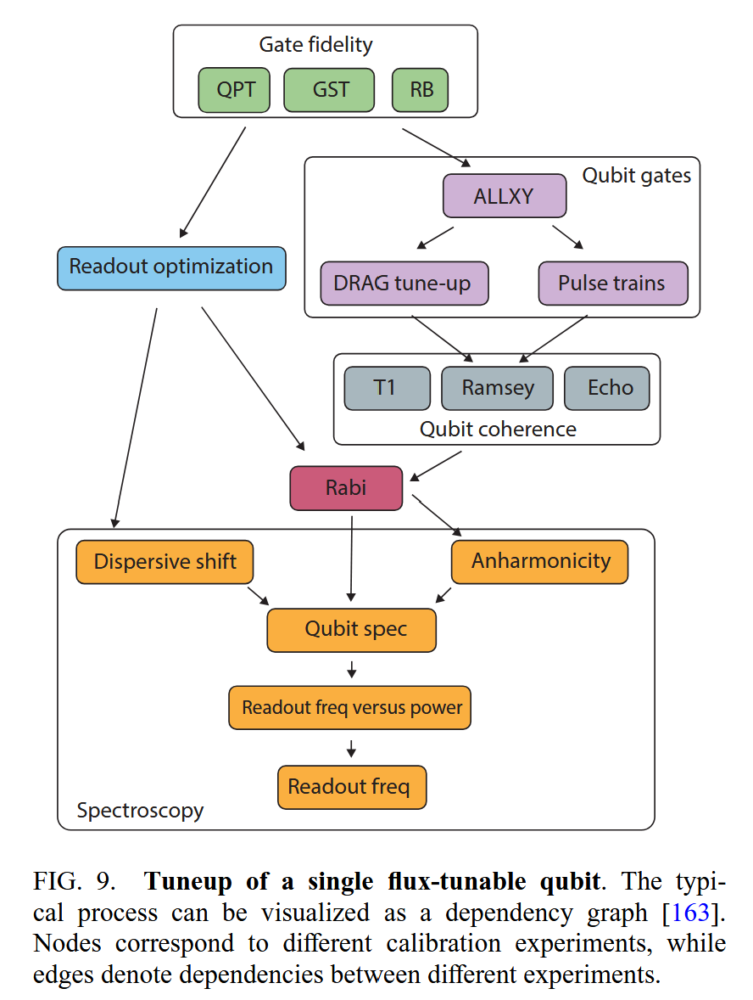
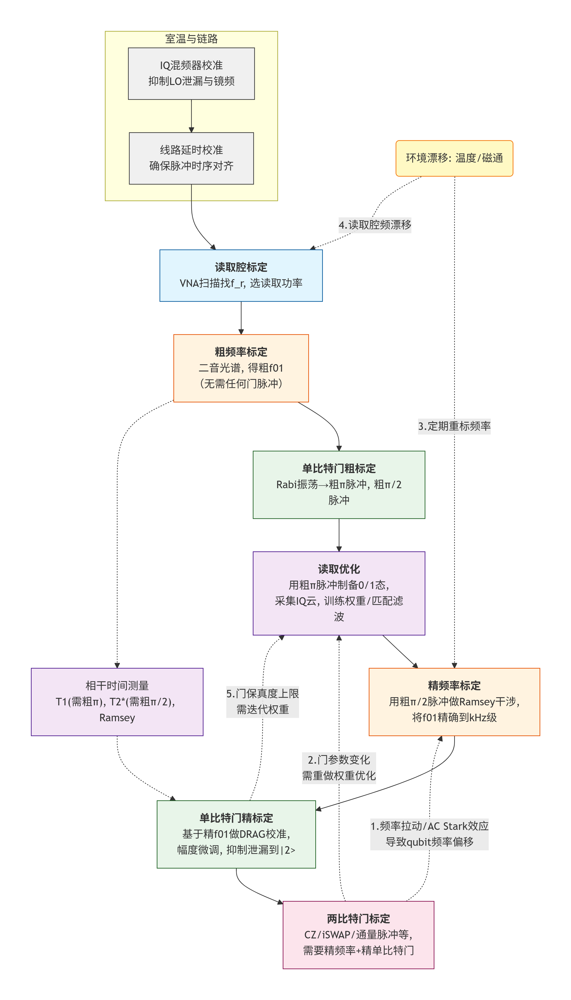

    可以看到，实线部分确实是一个DAG结构，虚线部分形成了一些环，这是工程中的迭代反馈过程，虽然不是严格的DAG，但可以通过一些策略来处理这些环路，如增加迭代次数限制，或引入额外的检查步骤来打破环路。
- **系统状态**：当前标定的结果(in spec, out of spec)

DAG框架需要满足以下要求：
- 全自动：校准过程不需要人工干预，能够自动执行，自主决策
- 最小化挂钟时间：校准过程的总时间尽可能短，尤其是对于需要频繁执行的校准
- 处理参数漂移：校准过程能够检测漂移并重新访问可能受影响的校准步骤，保持qubit性能稳定
- 自诊断：校准过程能够识别失败的步骤，并提供诊断信息以便修复

校准之间的依赖关系是一个DAG
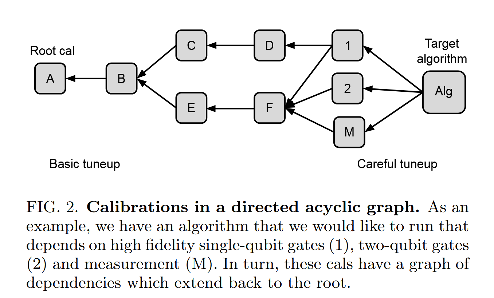
根据DAG图，A是一个根节点，其没有任何依赖，如qubit的频率校准，1,2,M为目标节点，是校准的最终目标，如单比特门校准。

为了判断确定当前状态，定义三个量：`check_state` `check_data` `calibrate`。他们在DAG的每个环节可以被输出，用于判断该环节的状态，三者有不同的时间开销，反应的系统状态量也不同。
- `check_state`：一个布尔值，基于先验知识和过往实验，来判断当前状态是否合规，包括
- `check_data`：选取少量数据，与预期曲线进行比较，若在预期曲线的容差内，合规，若不在容差内，不合规，若明显偏离，则认为数据出错，可能是其依赖项出问题了
- `calibrate`：完整的标定过程，有更改参数的权利

有了以上定义和状态参量，可以定义以下遍历算法，作为标定框架的工作流：

#### **maintain算法**:
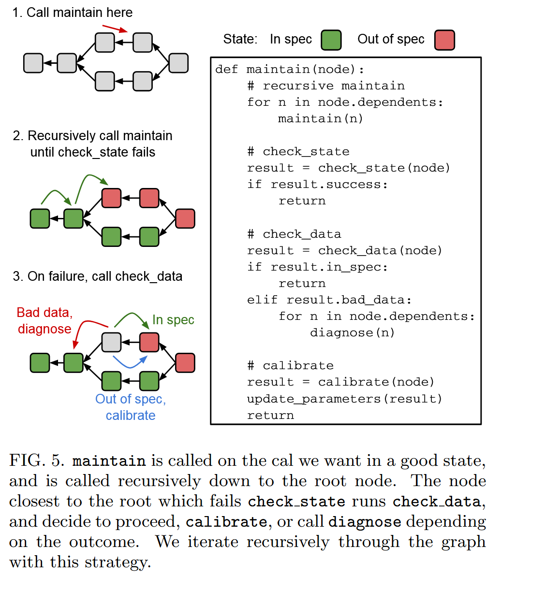
maintain算法需要再一个合规的Cal节点被调用，其决策流程如下：
- 调用C，递归向下至根
- 检查`check_state`
    - 若合规，返回
    - 若不合规，检查`check_data`
        - 若合规，返回
        - 若数据出错，运行`diagnose`，修复依赖项
        - 若不合规，运行`calibrate`，修复当前节点，并更新参数

#### **diagnose算法**:
当某个节点C的`check_data`显示数据出错时，运行diagnose算法来诊断问题所在。
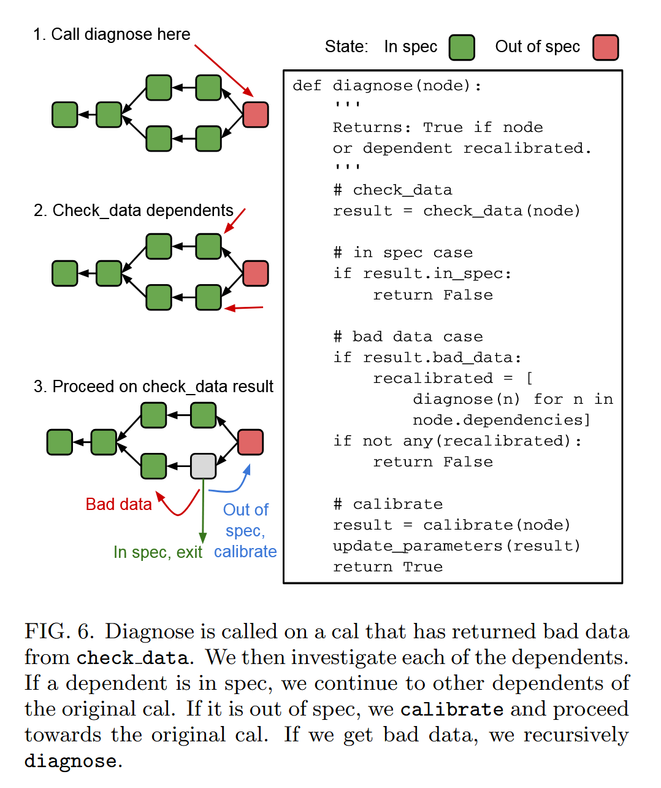


### 闭环反馈控制
[Vepsäläinen 2022 — Improving Qubit Coherence Using Closed-Loop Feedback]("C:\Users\21034\Desktop\Workspace\scholaraio\data\libraries\papers\Vepsalainen-2022-Improving-qubit-coherence-using-closed-loop-feedback")
<!--通过实时闭环反馈抑制qubit低频噪声，提高qubit相干性和门保真度。

反馈协议分为以下三个阶段;
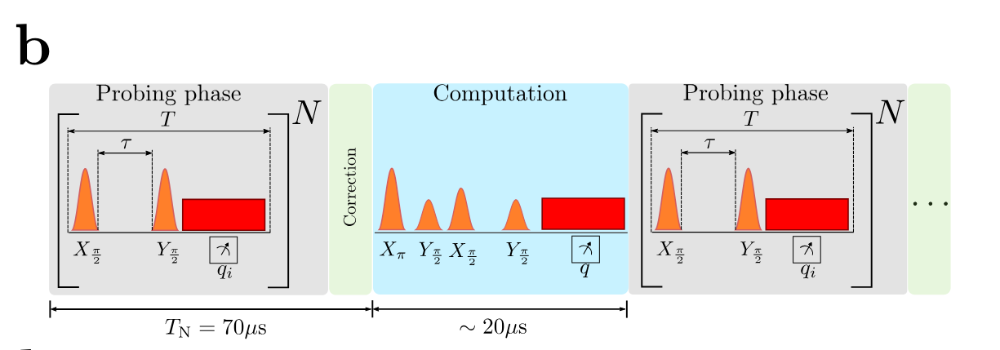
其中，灰色区域表示ramsey频率估计的探测阶段，测量qubit的频率，绿色区域表示控制阶段，根据估计结果猜测一个磁通变化值，改变qubit频率，蓝色区域表示算法处理阶段，根据测量结果更新频率估计的先验分布。

#### 探测阶段
探测阶段需要施加若干个ramsey测量，每次ramsey测量涉及以下过程：
- 初始化：施加$\pi/2-y$脉冲（脉冲已经校准？），将qubit置于$|+\rangle$态
- 演化：等待时间$\tau$，期间qubit频率发生变化，积累相位$\phi = 2\pi\int_0^\tau \delta f(t) dt$，$\delta f(t) = f_d - f_q(t)$，由于存在低频噪声，在演化阶段qubit频率不一定恒定
- 读出：施加$\pi/2-x$脉冲，利用色散读出得到qubit的状态$q_i$，$p_e$几率得到$\ket{1}$

考虑准静态近似：单次估计实验qubit频率近似不变，但是不同的实验之间qubit频率可能发生改变。[补充推导](#准静态近似的有效范围)

由于单次实验qubit频率不变，则理论激发态概率为
$$
p_e = \frac{1}{2}(1 + \cos(2\pi \delta f \tau - \pi/2))
$$
$$
\delta f = \frac{\pm \arccos(2p_e - 1) + 2\pi k + \pi/2}{2\pi \tau}
$$
为了避免相位wrap问题，一般先用spectroscopy粗扫得到k，确定$\delta f$的一一区间，再通过ramsey测量精确测量$\delta f$。
实验测得的$p_e$为
$$
p_e = \frac{\sum_i q_i}{N}
$$
为了避免每次需要将qubit复位至0，采用虚拟复位：
- 若上一次测量为$q_{i-1} = 1$，则下一次测量结果$q_i$取反，即$q_i' = q_i \oplus q_{i-1}$

#### 控制阶段
控制阶段需要根据测量的频率估计qubit频率的补偿值。

设频率误差为
$e = f_{q}(V_n) - f_0 $
-->

#### 标定背景
闭环反馈qubit频率标定的目标是实时自动化地将qubit频率精确校准到指定的工作点上，自动化的实现借助于DAG框架，与其他部分的标定形成依赖关系，qubit标定的实现借助优化算法，基于测量结果自动调整参数，达到快速收敛的目的，过程中不需要测量qubit的磁通响应关系，整个标定过程可以看做一个黑箱，其中只需外界提供目标频率点，DAG框架提供控制开关，当`calf == true`时，且输入`freq`非空，则启动频率标定算法，输出新的电流值`VO`与控制信号`VControl`，实现频率标定。

实验中磁通与电压信号满足
$$
\Phi = \Phi_{offset} + \alpha V
$$
由于环境的扰动，$\alpha,\Phi_{offset}$等参数会发生漂移，如果想要依赖响应函数$f(\Phi)$进行qubit标定，则需要涉及频率-磁通响应的标定，增加了标定的复杂度和时间开销。闭环反馈控制忽略了磁通响应的标定，直接通过测量频率与电压的关系，通过优化算法实现频率标定，实际的时间开销较小。

该qubit标定的依赖关系如下：
- 完成readout标定：可以区分qubit的0态和1态
- 完成qubit频率粗标定：利用spectroscopy等方法，得到qubit的电压区间[V_a, V_b]，其中$V_a, V_b$满足braket条件，即$r_ar_b < 0$
- 完成了$\pi/2$脉冲标定
具体可以参考DAG框架部分的图示。
#### 标定流程
标定流程可以写成如下伪代码：
```
f_0, epsilon_f = input() # 输入目标频率和容差
V_a, V_b = input() # 输入电压区间
V_n = (V_a + V_b) / 2 # 初始电压取区间中点
r_n = measure_frequency(V_n) - f_0 # 计算初始残差
while abs(r_n) > epsilon_f:
    V_next = update(V_n, r_n) # 基于测量结果和优化算法，计算下一个电压值
    if V_next < V_a or V_next > V_b:
        V_n = (V_a + V_b) / 2 # 若优化结果超出区间，则回退到区间中点
    else:
        V_n = V_next
    f_n = measure_frequency(V_n) # 测量当前电压下的频率
    r_n = f_n - f_0 # 计算残差
```
 
##### 目标
设置目标频率为$f_0$，当前电压$V_n$下，真实频率为$f_n = f_q(V_n)$，定义残差为
$$
r_n = f_n - f_0
$$
则目标为
$$
|r_n| < \epsilon_f
$$
其中$\epsilon_f$为频率标定的容差。

##### 更新算法(`update`)
更新有很多种思路，如果将$\min r_n$的问题看做求根问题，则可以使用二分法，牛顿迭代法等方法；如果将$\min r_n$的问题看做一个优化问题，则可以使用梯度下降法，拟牛顿法等方法。不同的方法可能需要不同的参数，但是整体流程是类似的。

由于标定目标只是单点频率标定，并且为了减小时间开销，直接复用因此使用secant方法即可。

##### 频率测量(`measure_frequency`)
频率测量部分会在后续介绍
#### 时间开销
相比于粗扫，闭环反馈控制的时间开销较小。

粗扫对于每个电压点都要做一次spectroscopy，施加可能以min记。闭环控制只需在每次迭代中施加一个Ramsey测量，且迭代次数通常较少（如5-10次），因此总的时间开销较小。

具体的，每次迭代的ramsey测量的时间开销为
$$
T_{ramsey} \approx N_{\tau}N_{shot}(T_{reset} + \tau + T_{readout})
$$
其中：
- $N_{\tau}$为ramsey测量中扫描的$\tau$点数，通常为10-20点
- $N_{shot}$为每个$\tau$点的重复测量次数，通常为1000-10000次，若只需测实时漂移，$N_{\tau}$和$N_{shot}$可以适当减少
- $T_{reset}$为qubit的复位时间，通常为1-10$\mu$s
- $\tau$为ramsey测量的演化时间，通常为0.1-10$\mu$s
- $T_{readout}$为qubit的读出时间，通常为1-10$\mu$s


<!--
分为工作点频率标定和磁通响应频率标定两类。前者适用于所有qubit，后者通常用于可调频qubit。

下面主要基于可调频qubit进行分析。完整的标定流程为：
- 首先标定响应曲线$f(\Phi)$
- 根据$f(\Phi)$，选择工作点电流
- 在该工作点上，精确标定qubit频率$f{01}$。作为未来qubit门操作的基准频率。

实验操作中，磁通通过DC偏置和Z线脉冲控制：
$$
\Phi(t) = \Phi_{DC} + \Phi_{Z}(t) = \alpha I_{DC} + \alpha I_Z(t)
$$
标定目标是确定-->
下面介绍两个测量频率的方法：
- Ramsey协议
- 瞬态磁场协议与核函数策略
### Ramsey协议
Ramsey干涉是用于qubit频率标定的标准协议。

对于定点频率$f_{01}$的测量：

首先扫描qubit能谱，获得$f_{01}$的初始估计值$f_{guess}$。随后在该频率附近进行Ramsey测量，设置脉冲频率$f_d = f_{guess}$，则失谐为$\Delta f = f_{01} - f_d$，扫描延迟时间$\tau$，得到Ramsey振荡图像。则振荡频率即为失谐$f_{fit} = |\Delta f|$，从而得到$f_{01} = f_d \pm | f_{fit} |$。

为了避免正负号，引入认为失谐。即将原来第二个脉冲的旋转轴绕Z轴旋转一个小角度$\phi =2\pi f_a \tau$。此时，拟合的振荡频率为$f_{fit} = \Delta f + f_a$

响应曲线只需选定一组磁通偏置电压点，在每个电压点进行定点标定，得到该电压点的频率。随后对所有电压点的频率进行拟合，得到响应曲线$f(\Phi)$。

### 瞬态磁场协议与核函数策略

#### 基本思想

瞬态磁场协议（Herb et al., Nat. Commun. 2025）的核心是使用两个正交的连续控制脉冲代替Ramsey脉冲：
$$ 
R_y(\alpha) - R_x(\alpha)
$$
在小失谐的情况下，施加该脉冲后4的激发态概率近似为
$$
p \approx p_0 + G_{\alpha}\delta 
$$

如果考虑失谐的时间变化，则可将脉冲看做一个时间核函数$k(t)$，测量结果是待测信号和核函数的卷积：
$$
p(t) = \int k(t' - t) \delta(t') dt'
$$
在这里，核函数就表示qubit频率在对脉冲不同时间点的敏感程度。有
$$
G_{\alpha} = \int k(t) dt
$$

这种方法最大的优势就是时间开销小，可以尽可能的减小脉冲宽度，以减小时间成本。不过，脉冲宽度存在理论上限，即QSL，且过短的脉冲会导致时间分辨率减小，因此使用这个脉冲进行频率测量时，最后还需用Ramsey做最终的精确矫正。

#### 具体实验实现

##### 核函数测量
理论上，理想的连续$\pi/2$脉冲的核函数可以写为
$$
k(t) = \begin{cases} \sin\left[\Omega\left(\frac{\tau_p}{2} - |t|\right)\right] & |t| < \tau_p/2 \\ 0 & |t| > \tau_p/2 \end{cases}
$$
但是，实际上，会有各种非理想因素，如AWG的有限采样率，脉冲失真，系统的非线性响应等，导致实际的核函数与理论值存在偏差。因此，需要通过实验测量来获取实际的核函数。

因此，在采用该方案时，qubit频率标定还有一个依赖关系，即需要先测量核函数，核函数的测量应该紧接qubit频率标定之前，因为其它标定步骤可能会影响核函数的形状。

关于核函数的测量，实际可以采取数值仿真和实际测量两种方法。

- **数值仿真**
仿真需要对系统的哈密顿量进行建模，并经可能的考虑所有非理想因素，例如能级泄露，波形失真等。

旋转坐标系下，Transmon qubit的哈密顿量可以写为
$$
H/\hbar = \Delta(t) a^{\dagger}a + \frac{\alpha}{2} a^{\dagger}a^{\dagger}aa + \frac{1}{2}(\Omega_x(t)(a + a^{\dagger}) + i\Omega_y(t)(a - a^{\dagger}))
$$
为了充分考虑非理想因素，必要时可以加入DRAG，BS shift等修正。

哈密顿量右半部分为脉冲项，脉冲项应该满足
$$
R_y(\alpha) - R_{x/-x}(\alpha)
$$

另外还需添加一个小的flux偏置，即
$$
H_{stim} = \hbar \delta\omega(t-t_0)a^\dagger a
$$
$\delta \omega$可以取一个窄Gaussian，面积为
$$
\phi_{stim} = \int \delta\omega(t) dt
$$
面积足够小，以保证系统的响应在$\phi_{stim}$的线性范围内。

扫描$t_0$，并在每个$t_0$处进行两次仿真，分别施加$+\delta \omega$和$-\delta \omega$，得到差分响应即为核函数
$$
k(t_0) = \frac{p_e\big|_{+\delta \omega} - p_e\big|_{-\delta \omega}}{2\phi_{stim}}
$$
为了消掉偶次误差，可以在每次实验中换脉冲的旋转轴，即$R_x(\alpha)$和$R_{-x}(\alpha)$，计算
$$
p_e = \frac{p_e\big|_{R_x} - p_e\big|_{R_{-x}}}{2}
$$

仿真的优势是可以根据仿真结果去选择合适的脉冲参数，如$\alpha$，$\tau_p$等，以获得更好的时间分辨率和灵敏度。同时尽可能地避免一些非理想因素的影响，如能级泄露，波形失真等。
- **实验测量**
实验上可以通过施加Virtual Z来实现一个小的频率偏移。Virtual Z通过控制$t_j$之后的脉冲相位整体平移$\phi_z$来实现，类似仿真的方法，扫描$t_j$，并在每个$t_j$处施加$+\phi_z$和$-\phi_z$，得到差分响应即为核函数
$$
k(t_j) = \frac{p_e\big|_{+\phi_z} - p_e\big|_{-\phi_z}}{2\phi_z}
$$
其中，$p_e$满足
$$
p_e = \frac{p_e\big|_{R_x} - p_e\big|_{R_{-x}}}{2}
$$

另外，也可以直接施加一个小的flux脉冲来实现频率偏移，即
$$
V_{stim}(t - t_j)
$$
则
$$
\delta \omega(t) = \frac{d\omega}{dV} V_{stim}
$$
不过，需要注意的是，由于AWG的输出信号经过了预失真处理，因此实际测得的信号包含
$$
p_e = k \ast h_{filt} \ast V
$$


该框架的关键优势在于：**核函数由脉冲序列唯一确定，反卷积框架对核函数形状无任何假设**。这意味着可以使用任意脉冲序列作为探测脉冲，只要能计算（或测量）其核函数。

##### 频率测量
在频率测量阶段，施加两种脉冲序列
$$
R_y(\alpha) - R_x(\alpha), \quad R_y(\alpha) - R_{-x}(\alpha)
$$
定义差分信号
$$
p_e = \frac{p_e\big|_{R_x} - p_e\big|_{R_{-x}}}{2}
$$
则
$$ 
p_e(t) = k \ast \delta \omega
$$
通过反卷积可以得到频率，如果考虑准静态近似，即$\delta \omega$在测量过程中近似不变，则可以直接通过积分得到频率：
$$
\delta \omega = \frac{p_e}{\int k(t) dt} = \frac{p_e}{G_{\alpha}}
$$
#### 进一步应用
这个协议实际上比测量静态频率更为通用，其可以通过反卷积得到flux的时变波形，因此还可以用于flux的标定。例如，测量一个flux到达qubit的失真，从而对flux进行预失真标定。

<!--
#### 核函数的一般定义

对于任意控制脉冲序列 $H_{\text{ctrl}}(t)$，其核函数定义为：在时刻 $t_0$ 施加一个 $\delta$ 刺激磁场时，测量结果相对于基线的变化：

$$
k(t_0) = \lim_{\epsilon \to 0} \frac{p_e\big|_{B(t)=\epsilon\delta(t-t_0)} - p_e\big|_{B=0}}{\epsilon}
$$

实际计算中，$\delta$ 函数用窄高斯脉冲近似，$\epsilon$ 用有限幅度近似。对脉冲序列时间轴上的每个采样点逐一施加刺激脉冲，即可数值计算出完整的核函数。

#### 不同脉冲序列的核函数

##### (1) 零延迟 Ramsey（$\tau = 0$）

脉冲序列为两个相位正交的 $\pi/2$ 脉冲首尾相连（P1-P2），等价于 Ramsey 干涉中 $\tau = 0$ 的极限情况。其核函数的解析形式为（Herb & Degen, PRL 2024）：

$$
k(t) = \begin{cases} \sin\left[\Omega\left(\frac{\tau_p}{2} - |t|\right)\right] & |t| < \tau_p/2 \\ 0 & |t| > \tau_p/2 \end{cases}
$$

其中 $\Omega$ 为 Rabi 频率，$\tau_p$ 为脉冲总持续时间。核函数为单峰正弦形，FWHM 给出时间分辨率：

$$
t_{\min} = \tau_p \left(1 - \frac{\arcsin\frac{\sin\alpha/2}{\alpha}}{\alpha}\right)
$$

其中 $\alpha = \Omega\tau_p/2$ 为旋转角度。对于 $\alpha = \pi/2$（标准 $\pi/2$ 脉冲），$t_{\min} \approx 0.59\tau_p$。

**特点**：核函数最窄，时间分辨率最高，但核函数面积（$\propto$ 灵敏度）最小。

##### (2) 有限延迟 Ramsey（$\tau > 0$）

在两个 $\pi/2$ 脉冲之间插入自由演化时间 $\tau$，核函数变为：

$$
k(t) \approx \begin{cases}
\sin\left[\Omega\left(\frac{t_{\pi/2}}{2} - |t|\right)\right] & |t| < t_{\pi/2}/2 \quad \text{（第一个 $\pi/2$）} \\
1 & t_{\pi/2}/2 < t < t_{\pi/2}/2 + \tau \quad \text{（自由演化）} \\
\sin\left[\Omega\left(\frac{t_{\pi/2}}{2} - |t - \tau - t_{\pi/2}|\right)\right] & \text{（第二个 $\pi/2$）} \\
0 & \text{其他}
\end{cases}
$$

其结构为：**正弦上升沿 — 平坦 plateau — 正弦下降沿**。核函数总宽度约为 $2t_{\pi/2} + \tau$，面积约为 $\tau + \frac{2}{\Omega}$。

**关键trade-off**：$\tau$ 越大，核函数面积越大（灵敏度越高），但宽度也越大（时间分辨率越低）。反卷积可以部分恢复被宽核函数模糊的分辨率，但会放大噪声。

灵敏度与时间分辨率的关系：
$$
B_{\min} \propto \frac{1}{\int k(t)dt} \propto \frac{1}{\tau + 2/\Omega}, \quad t_{\min} \propto 2t_{\pi/2} + \tau
$$

##### (3) Spin Echo 核函数

脉冲序列：$(\pi/2)_X \to \tau \to \pi_Y \to \tau \to (\pi/2)_X$

$\pi$ 脉冲翻转调制函数符号，核函数出现正负交替：

$$
k_{\text{echo}}(t) \approx \begin{cases}
+k_{\pi/2}(t) & \text{第一个 $\pi/2$ 区间} \\
+1 & \text{第一个自由演化} \\
\text{flip} & \text{$\pi$ 脉冲附近} \\
-1 & \text{第二个自由演化} \\
-k_{\pi/2}(t) & \text{第二个 $\pi/2$ 区间}
\end{cases}
$$

**特点**：核函数的直流分量（零频响应）为零，即 $\int k_{\text{echo}}(t) dt \approx 0$。这意味着 Echo 核天然抑制低频噪声和恒定偏置，等价于一个带通滤波器。

频域响应的中心频率约为 $\omega_c \approx \pi / \tau$。

##### (4) CPMG 核函数

CPMG 为 Spin Echo 的多次重复版本。脉冲间隔 $\tau$ 确定带通中心频率，重复次数 $N$ 确定带宽。核函数为多个正负交替的段落：

$$
k_{\text{CPMG}}(t) \approx \sum_{j=0}^{N} (-1)^j \cdot \text{rect}\left(\frac{t - t_j}{\tau}\right)
$$

频域响应峰在 $\omega_c = \pi/\tau$，带宽 $\Delta\omega \approx 2\pi/(N\tau)$。

**特点**：频率选择性最强，适合已知频率的 AC 信号检测。

#### 统一框架

以上所有脉冲序列可以统一到同一个测量-反卷积框架中：

| 步骤 | 操作 | 对所有脉冲序列通用 |
|------|------|-------------------|
| 1 | 构建脉冲序列 | `create_ramsey_pulse`, `create_echo_pulse`, `create_cpmg_pulse` |
| 2 | 数值计算核函数 | `CompositePulse.get_kernel(qubit)` |
| 3 | 等效时间采样 | `Protocal.sliding_measurement(qubit, Phi, control_pulse)` |
| 4 | 基线扣除 | $\delta p = p_{\text{signal}} - p_{\text{baseline}}$ |
| 5 | 反卷积 | `wiener_deconvolution(delta_p, kernel, dt, lambda)` |

**核函数是脉冲序列与物理系统之间的桥梁**：改变脉冲序列等价于更换核函数，而反卷积框架无需任何修改。

#### 应用于频率标定

##### 静态标定的局限

原始瞬态磁场协议使用 $\tau = 0$ 的 Ramsey 脉冲，核函数窄，面积小。对于静态频率 $f_{01}$ 的测量，核函数面积直接决定了对恒定信号的灵敏度：

$$
\delta p_e \approx \kappa \cdot h \cdot \int k(t) dt
$$

$\tau = 0$ 时 $\int k(t)dt \approx 2/\Omega$（很小），因此对静态信号的信噪比远不如标准 Ramsey（$\int k(t)dt = \tau_{\text{Ramsey}}$ 可以任意长）。

因此，对于 $f_{01}$ 定点标定和静态 $f(\Phi)$ 曲线标定，标准 Ramsey 仍然是最优选择。

##### 动态标定的优势

在量子门操作中，qubit 频率随时间快速变化（如 CZ 门中的 flux pulse 使频率在数十 ns 内变化数百 MHz）。标准 Ramsey 的长演化时间使其无法捕捉这种快速变化——它测到的是整个演化时间内的**平均**频率。

瞬态磁场协议的核函数框架可以追踪频率的瞬时变化。具体地：

设 qubit 频率偏移为时变函数 $\delta\omega(t)$，则：

$$
\delta p_e(t_d) = \int k(t' - t_d) \cdot \delta\omega(t') \, dt'
$$

通过反卷积：

$$
\delta\omega(t) = \mathcal{F}^{-1}\left[\frac{\hat{K}^*(\omega)}{|\hat{K}(\omega)|^2 + \lambda^2} \hat{P}(\omega)\right]
$$

还原出 $\delta\omega(t)$ 的时间演化曲线。

##### 核函数选择策略

对于频率标定，核函数的选择取决于待标定信号的特征时间尺度 $t_{\text{sig}}$：

| 信号特征 | 推荐核函数 | 理由 |
|----------|-----------|------|
| 静态/准静态（$t_{\text{sig}} \gg T_2$） | 标准 Ramsey（长 $\tau$）| 最大灵敏度，不需要反卷积 |
| 中等速率（$t_{\text{sig}} \sim 10\text{-}100$ ns） | Ramsey $\tau > 0$ + 反卷积 | 兼顾灵敏度和分辨率 |
| 快速瞬态（$t_{\text{sig}} < 10$ ns） | Ramsey $\tau = 0$ | 最高分辨率 |
| 有低频噪声背景 | Echo + 反卷积 | 抑制低频噪声 |

$\tau$ 的最优选择可以通过最小化反卷积后的重建误差来确定：

$$
\tau_{\text{opt}} = \arg\min_\tau \left\| B_{\text{recon}}(\tau) - B_{\text{true}} \right\|^2
$$

在仿真中可以系统性地扫描 $\tau$，绘制分辨率-灵敏度 trade-off 曲线（类似 Herb et al. Fig. 5，但基于反卷积后的实际分辨率而非核函数 FWHM 的理论分辨率）。

##### 非线性标定

以上分析假设线性近似 $\delta\omega \approx \kappa\Phi$。对于大信号，非线性项不可忽略：

$$
\delta\omega(\Phi) = \kappa\Phi + \frac{1}{2}\kappa'\Phi^2 + \cdots
$$

此时测量模型变为 Hammerstein-Wiener 结构：

$$
\delta p_e(t_d) = \int k(t'-t_d) \cdot g\left[\Phi(t')\right] dt'
$$

其中 $g(\Phi) = \delta\omega(\Phi)$ 是非线性静态映射。若 $\Phi(t)$ 已知（如施加已知的斜坡或正弦标定信号），可以将 $g(\Phi)$ 参数化为多项式 $g(\Phi) = \sum_n c_n \Phi^n$，则测量模型变为关于 $\{c_n\}$ 的**线性**方程：

$$
\delta p_e(t_d) = \sum_n c_n \underbrace{\int k(t'-t_d) \cdot \Phi^n(t') dt'}_{R_n(t_d)}
$$

$R_n(t_d)$ 可预计算，$\{c_n\}$ 通过正则化最小二乘一步求解。这实现了从一次滑动测量扫描中同时提取线性灵敏度 $c_1 = \kappa$、二阶非线性 $c_2 = \kappa'/2$ 等所有标定系数。
-->
### 混合框架
考虑到Ramsey框架的时间开销以及QSL框架的精度不足，可以考虑一个混合框架，先使用spectroscopy和Ramsey协议进行粗标定，得到一个初始的频率估计值；随后使用QSL框架快速接近目标频率，最后使用长Ramsey进行精确验证和微调。

失真可以分为LP和HP失真，LP失真会阻碍高频信号，导致系统响应变慢；HP失真会阻碍低频信号，导致系统在长时间尺度下会逐渐衰减
## 预失真
超导量子处理器中，通过flux-z线施加磁通信号控制qubit频率。但是，磁通信号在室温AWG产生，到传入低温SQUID环的路径中，会产生失真，从而影响门操作。因此，需要对输入的磁通信号进行预失真处理，以补偿失真。

将失真建模为一个线性系统，AWG的输入电压为$V_{in}(t)$，$h$表示失真，则有卷积关系
$$
\Phi_Q(t) = h \star V_{in}(t)
$$
$\Phi_Q$为穿过SQUID的真实磁通。

$h$更形式地称为系统脉冲响应，为线性时不变（LTI）系统对输入$\delta$函数的响应。即
$$
h(t) = \Phi_Q(t)\bigg|_{V_{in}(t') = \delta(t')}
$$
其中$V_{in}$的作用是在$t' = 0$触发一个输入，$h(t)$表示其在触发后t时刻的响应大小。因此越小的t值对应的h，代表了系统越快的响应。

其决定了LTI系统对任意$V_{in}$的响应行为。一个固定的失真源对应唯一的响应函数$h$，系统总响应为各响应的卷积。

系统的阶跃响应定义为输入的信号为阶跃信号$V_{in}(t) = V_0 u(t)$时，对应的输出$\Phi_Q(t)$：
$$
s(t) = \Phi_Q(t)\bigg|_{V_{in}(t') =  u(t')} =  \int_{0}^{t} h(\tau) d\tau
$$
其与h的关系为
$$
s(t) = h \star u(t) = \int_{-\infty}^{\infty} h(\tau) u(t-\tau) d\tau = \int_{0}^{t} h(\tau) d\tau
$$
$$
h(t) = \frac{ds(t)}{dt}
$$

对于理想情形，$h(t) = \delta(t), s(t) =  u(t)$，即系统对输入的$\delta$函数有一个瞬时响应，随后没有任何响应。此时，SQUID的磁通$\Phi_Q(t) = V_{in}(t)$，输入的电压信号完全转化为磁通信号，没有任何失真。

对于实际系统，可以找一个滤波器$h_{filt}$，使得$s_{corr} =  s \star h_{filt}$尽可能接近理想阶跃响应$s_{ideal} = u(t)$，从而实现预失真补偿。

在实际实验中，波形标定的逻辑线路可以总结为：
- Chevron实验发现波形失真
- 测量失真（即阶跃响应）
- 设计预失真滤波器
- 定量或定性验证

下面依次介绍各个部分：

### Chevron实验
Chevron实验本质上是将两个能级调到近共振，然后看激发数是否发生交换振荡的二维谱实验，常见有两类：
- 单比特Rabi Chevron：扫微波失谐，看Rabi振荡
- 两比特flux Chevron：扫flux幅度和持续时间，看交换振荡

#### 单比特Rabi Chevron
进行Rabi实验，设失谐为$\Delta$，Rabi频率为$\Omega$，则激发态概率为
$$
p_e(t) = \frac{\Omega^2}{\Omega^2 + \Delta^2} \sin^2\left(\frac{\sqrt{\Omega^2 + \Delta^2}}{2} t\right)
$$
扫描脉冲频率$\omega_d$和脉冲持续时间，得到二维图像$p_e(\Delta, t)$，可以得到一个Chevron图像。
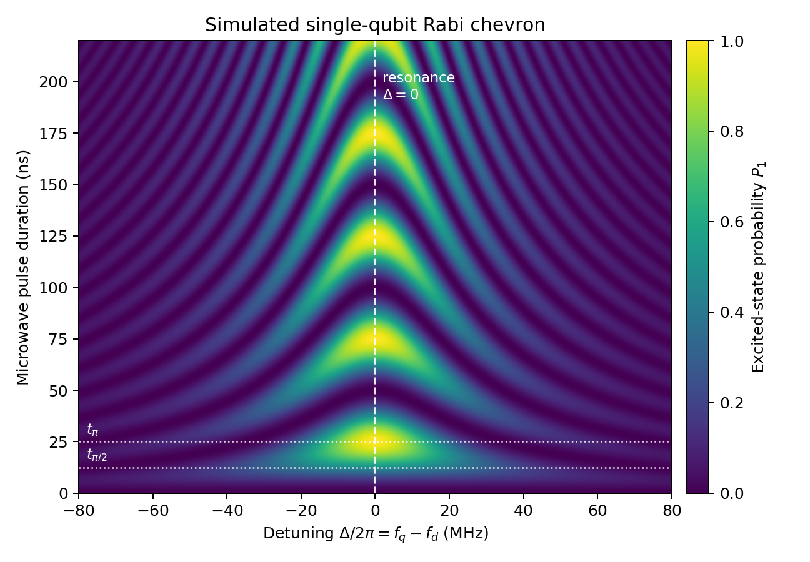
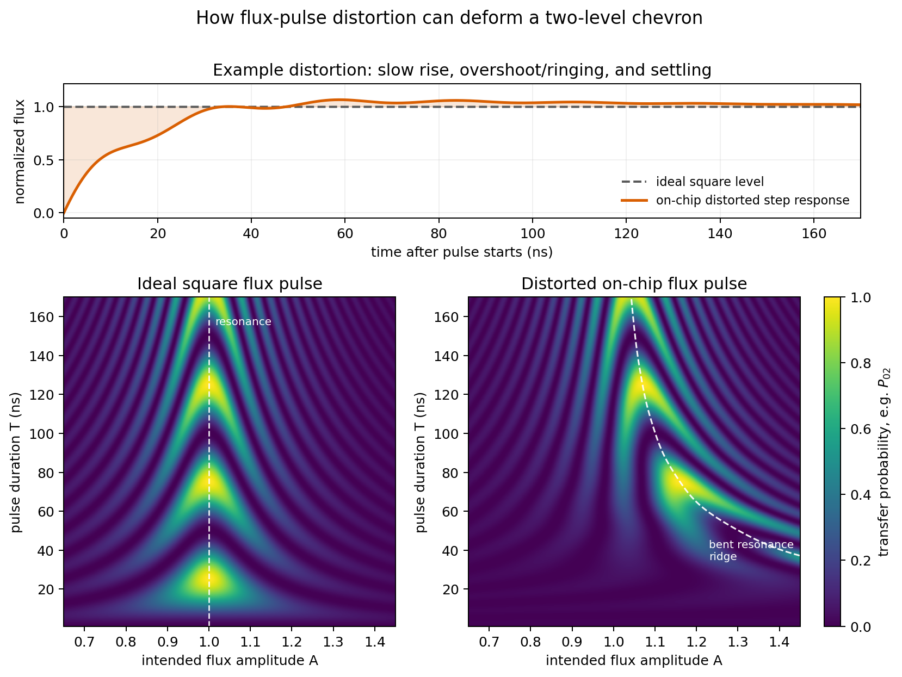
上图为一个理想Chevron图像以及一个波形失真的图像，从图中可以得到以下信息：
- qubit频率：$\Delta = 0$处的线
- $\pi$脉冲时间：$\Delta = 0$处的第一个振荡峰的位置
- 失真：若波形存在失真，或者有其他非理想因素，则会导致图像的变形，例如振荡频率不均匀，振荡幅度不均匀等。

#### 两比特flux Chevron
考虑一个耦合系统，哈密顿量为
$$
H/\hbar = \sum_{i = 1, 2}[\omega_i(t) a_i^{\dagger}a_i + \frac{\alpha_i}{2} a_i^{\dagger}a_i^{\dagger}a_ia_i] + g(a_1^{\dagger}a_2 + a_1a_2^{\dagger})
$$
考虑子空间$\{\ket{11}, \ket{02}\}$，子空间哈密顿量为
$$
H = \begin{bmatrix}\Delta/2 & \sqrt{2}g \\ \sqrt{2}g & -\Delta/2 \end{bmatrix}
$$
近共振时，即$\Delta \approx 0$，会发生交换振荡，激发态概率为
$$
p_{11}(t) = \frac{8g^2}{\Delta^2 + 8g^2} \sin^2\left(\frac{\sqrt{\Delta^2 + 8g^2}}{2} t\right)
$$
与Rabi类似，扫flux幅度，$\Delta$相应改变，扫持续时间，得到二维图像$p_{11}(\Delta, t)$，可以得到一个Chevron图像。
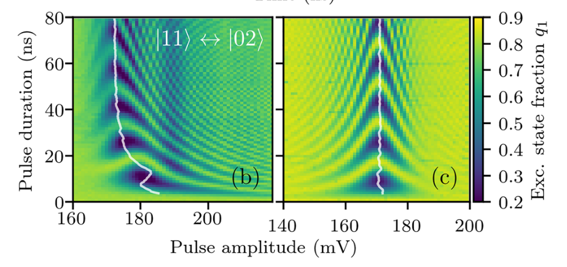

因此，通过Chevron实验可以获得qubit和脉冲的基本信息，但还不足以定量分析失真，因此需要进一步测量系统的阶跃响应。

### 阶跃响应测量
该部分直接运用之前介绍的几个磁场重建方法，如瞬态磁场协议等
### 设计滤波器

#### cryoscope协议
之前已经介绍，cryoscope协议可以测量到达SQUID的真实磁通。如果通过AWG施加一个理想阶跃信号$V_{in}(t) = u(t)$，则通过cryoscope协议测量到的磁通$\Phi_Q(t)$即为系统的阶跃响应$s(t)$。

随后通过IIR和FIR滤波器设计目标滤波器。IIR可以处理长时间尺度的失真，FIR可以处理短时间尺度的失真。

一阶IIR的阶跃响应为
$$
s_{IIR}(t) = h_{IIR} \star u(t) = g(1 + A^{-t/\tau_{IIR}})u(t)
$$

cryoscope的思路为将测得的$s(t)$看做一系列阶跃函数指数分量的叠加，即
$$
s(t) = \sum_{i} g_i(1 + A_i^{-t/\tau_i})u(t)
$$
通过$N$个IIR级联来修正这些指数分量，从而得到一个接近理想阶跃响应的阶跃响应。

具体的，利用优化算法，使得该滤波器与测量到的阶跃响应卷积后尽可能接近理想阶跃响应。

利用优化得到的IIR滤波器，输入到AWG中，进行第一次滤波补偿，并进行第二次测量，得到第一次补偿后的阶跃响应。

随后进行FIR滤波器设计。

FIR滤波器的输出为
$$
y[n] = \sum_{i=0}^{N} h_{FIR}[i] x[n-i]
$$
其中$h_{FIR}$为滤波器的系数，$N$为滤波器的阶数。

由于FIR的非线性不强，且loss函数有多个极小，因此采用CMA-ES进化算法进行优化，找到最优的FIR滤波器系数。

## 瞬态磁场协议
瞬态磁场协议具有更高的时间分辨率，可以测量实际阶跃响应的细节，从而更准确地设计预失真滤波器。

例如，由于cryoscope协议的分辨率受到脉冲宽度的影响，因此无法捕捉到系统在10 ns内的快速响应细节。因此对于CZ门涉及的10ns以下的失真，cryoscope协议可能无法提供足够的信息来设计有效的预失真滤波器。而瞬态磁场协议可以通过选择$\tau = 0$的Ramsey脉冲，获得10 ns以下的时间分辨率，从而捕捉到这些快速失真的细节。

不过，瞬态磁场协议对于长时间尺度的测量信噪比较低，因此对于10 ns以上的失真，可能无法提供足够的信噪比来准确测量阶跃响应的细节。在这种情况下，cryoscope协议可能更适合。

综合以上，考虑如下混合策略：

首先利用cryoscope进行两次滤波器补偿，得到10ns以上的预失真补偿。

随后AWG输出两次补偿后的阶跃信号，利用瞬态磁场协议测量SQUID的阶跃响应（关于脉冲具体参数需要根据实际情况调整）。

随后构造FIR滤波器，利用CMA-ES算法优化滤波器系数，使得滤波器的阶跃响应尽可能接近理想阶跃响应。补偿10ns以下的失真。

### 多 qubit 推广：从预失真到串扰补偿

以上分析针对单条 Z 线的自身失真（传递函数 $h_{ii}$）。在多 qubit 处理器中，需要进一步考虑 Z 线之间的**串扰**（传递函数 $h_{ji}$, $j \neq i$）。预失真和串扰补偿是同一个传递矩阵问题的对角和非对角部分。

#### 传递矩阵模型

对于 $N$ 个 qubit 的处理器，所有 Z 线的输入-输出关系统一为：

$$
\hat{\Phi}_j(\omega) = \sum_{i=1}^{N} \hat{H}_{ji}(\omega) \hat{V}_i(\omega), \quad j = 1, \ldots, N
$$

矩阵形式：

$$
\hat{\mathbf{\Phi}}(\omega) = \hat{\mathbf{H}}(\omega) \hat{\mathbf{V}}(\omega)
$$

其中 $\hat{\mathbf{H}}(\omega) \in \mathbb{C}^{N \times N}$ 是频率依赖的传递矩阵：
- **对角元** $H_{ii}(\omega)$：qubit $i$ 自身 Z 线的传递函数（包含线路失真）
- **非对角元** $H_{ji}(\omega)$, $j \neq i$：从 Z 线 $i$ 到 qubit $j$ 的串扰传递函数

理想系统中 $\hat{\mathbf{H}} = \text{diag}(\alpha_1, \ldots, \alpha_N)$（无串扰、无失真，$\alpha$为各qubit的电压磁通转化系数），实际系统中非对角元非零且对角元偏离理想值。

#### 串扰的物理来源

非对角元 $H_{ji}$ 来源于多种寄生耦合路径：

1. **互感耦合**（主导）：Z 线之间通过空间电磁耦合产生互感 $M_{ij}$，$\Phi_j^{\text{xtalk}} = M_{ij} I_i$
2. **地平面回流**：flux pulse 的返回电流通过公共地平面扩散，在其他 qubit SQUID 中感应磁通
3. **键合线/封装耦合**：芯片内键合线互感、PCB 走线串扰
4. **衬底涡流**：磁通脉冲在衬底中感应涡流，产生长程慢衰减的串扰（$\mu$s 量级）

其中，$H(\omega = 0)$为静态串扰，可以通过标准的直流偏置电压扫描进行校准。

$\omega$非零时代表动态串扰，动态串扰对快速变化的脉冲影响较大，需要利用动态传感协议进行标定。


#### 串扰对门操作的影响

对 qubit $A$ 施加 CZ 门 flux pulse $V_A(t)$ 时，qubit $B$ 受到的串扰磁通为：

$$
\Phi_B^{\text{xtalk}}(t) = h_{BA} * V_A(t)
$$

导致 qubit $B$ 积累寄生相位：

$$
\phi_B^{\text{parasitic}} = \int_0^{T_{\text{gate}}} \kappa_B \cdot \Phi_B^{\text{xtalk}}(t) \, dt
$$

若 $|\phi_B^{\text{parasitic}}| \gtrsim 10^{-3}$ rad，将产生显著的 Z-error，影响门保真度。

#### 完整标定方案

完整的传递矩阵 $\hat{\mathbf{H}}(\omega)$ 标定需要测量 $N^2$ 个元素。根据前面的分析，对角元和非对角元适合不同的测量协议：

**对角元 $H_{ii}$：Cryoscope**

在 qubit $i$ 的甜点处，对其自身 Z 线施加阶跃脉冲，用截断 Ramsey 测量阶跃响应。甜点处的二次非线性抑制截断瞬态误差，精度可达 0.1%。

**非对角元 $H_{ji}$：瞬态磁场协议**

对 Z 线 $i$ 施加测试脉冲 $V_i(t)$，在 qubit $j$ 上使用滑动 Ramsey 测量响应。qubit $j$ 工作在最优灵敏度点（$\kappa_j$ 最大），对小串扰信号有线性响应。

测量模型：

$$
\delta p_e^{(j)}(t_d) = \kappa_j \int k(t' - t_d) \cdot \left[h_{ji} * V_i\right](t') \, dt'
$$

Wiener 反卷积还原串扰波形：

$$
\Phi_j^{\text{xtalk}}(t) = \frac{1}{\kappa_j} \mathcal{F}^{-1}\left[\frac{\hat{K}^*}{|\hat{K}|^2 + \lambda^2} \delta\hat{P}_e^{(j)}\right]
$$

进而提取串扰传递函数：

$$
\hat{H}_{ji}(\omega) = \frac{\hat{\Phi}_j^{\text{xtalk}}(\omega)}{\hat{V}_i(\omega)}
$$

**为什么非对角元不适合用 Cryoscope**：Cryoscope 的核心优势来自甜点处的截断瞬态抑制，但在甜点处 $\kappa = 0$，频率对磁通是二次响应（$\delta\omega \propto \Phi^2$），对于小串扰信号（$\Phi_{\text{xtalk}} \sim 0.003\,\Phi_0$）灵敏度极低。若改在非甜点工作以获得线性灵敏度，则截断瞬态误差不再被抑制，Cryoscope 相对于其他方法的核心优势消失。瞬态磁场协议不需要截断信号，因此不受此限制，可以自由选择最优灵敏度工作点。

#### 全局补偿

标定完整传递矩阵后，对每个频率点做矩阵求逆即可得到全局补偿：

$$
\hat{\mathbf{V}}_{\text{comp}}(\omega) = \hat{\mathbf{H}}^{-1}(\omega) \hat{\mathbf{\Phi}}_{\text{target}}(\omega)
$$

这同时补偿了自身失真（对角元）和串扰（非对角元）。$\hat{\mathbf{H}}^{-1}(\omega)$ 可通过 FIR 滤波器在 AWG 上实时实现。

#### 标定流程总结

| 步骤 | 内容 | 方法 | 测量次数 |
|------|------|------|---------|
| 1 | 标定对角元 $H_{ii}$, $i = 1, \ldots, N$ | Cryoscope（甜点） | $N$ 次 |
| 2 | 标定非对角元 $H_{ji}$, $j \neq i$ | 瞬态磁场协议（最优灵敏度点） | $N(N-1)$ 次 |
| 3 | 组装传递矩阵 $\hat{\mathbf{H}}(\omega)$ | 数据处理 | — |
| 4 | 计算补偿滤波器 $\hat{\mathbf{H}}^{-1}(\omega)$ | 逐频率矩阵求逆 | — |
| 5 | 实现为 AWG 实时滤波 | FIR/IIR 参数化 | — |
| 6 | 验证 | 对所有 qubit 重新测量残余失真和串扰 | $N^2$ 次 |

对于典型的 $N = 5\text{-}20$ qubit 处理器，非对角元数量 $N(N-1) = 20\text{-}380$。实际中仅需标定物理上相邻的 qubit 对（串扰随距离快速衰减），有效标定数量通常为 $\sim 2N\text{-}4N$。


# 附
## 准静态近似的有效范围
