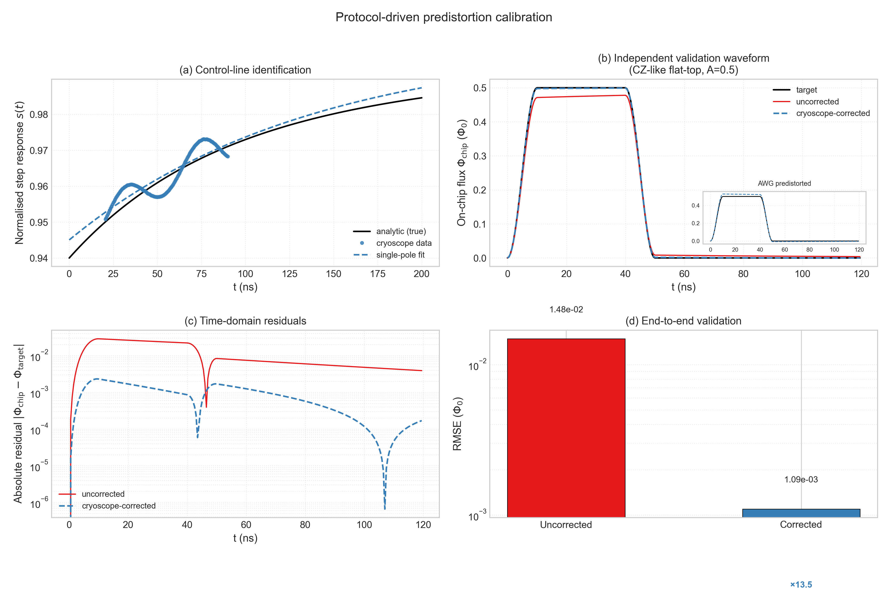

# P6 - Protocol-driven predistortion calibration

Report figure for control-line identification, inverse-filter design, and
held-out waveform validation.



## Figure content

- **(a) Control-line identification:** analytic dual-exponential response,
  Cryoscope samples, and the single-pole model used by the realizable inverse.
- **(b) Independent validation:** target, uncorrected on-chip waveform, and
  Cryoscope-calibrated correction. The inset shows the required AWG waveform.
- **(c) Residuals:** absolute on-chip flux error on a logarithmic scale.
- **(d) End-to-end metric:** validation RMSE before and after correction.

## Frozen result

| Quantity | Value |
|---|---:|
| Cryoscope fit amplitude | 0.05497 |
| Cryoscope fit time constant | 135.9 ns |
| Step-response RMSE | 0.00344 |
| Uncorrected validation RMSE | 1.482e-2 Phi0 |
| Corrected validation RMSE | 1.095e-3 Phi0 |
| RMSE improvement | 13.5x |
| Corrected AWG range | -0.0075 to 0.5280 Phi0 |

## Transient qualification boundary

The transient-Wiener path is retained in the NPZ and JSON diagnostics, but is
not used for the report-level inverse filter. After matched ideal-line gain
calibration it remains insensitive to the small near-DC difference between the
ideal step and the 6% slow tail. Its fitted inverse worsens held-out RMSE
(3.983e-2 Phi0), although it is finite and bounded. This is an evidence-based
method-selection result: Cryoscope identifies this slow control-line response;
transient sensing remains appropriate for finite-band waveform reconstruction,
not for this DC-step transfer estimate with the current Wiener adapter.

## Data

`protocol_comparison_sqc.npz` stores the Cryoscope and transient measurements,
fits, reference gain, AWG waveforms, corrected chip waveforms, and analytic
ground truth. `protocol_comparison_metrics.json` stores metrics and environment
versions.

Regenerate with:

```bash
python result_sqc/predistortion/P6_protocol_comparison/generate_protocol_comparison_sqc.py --recompute
```
