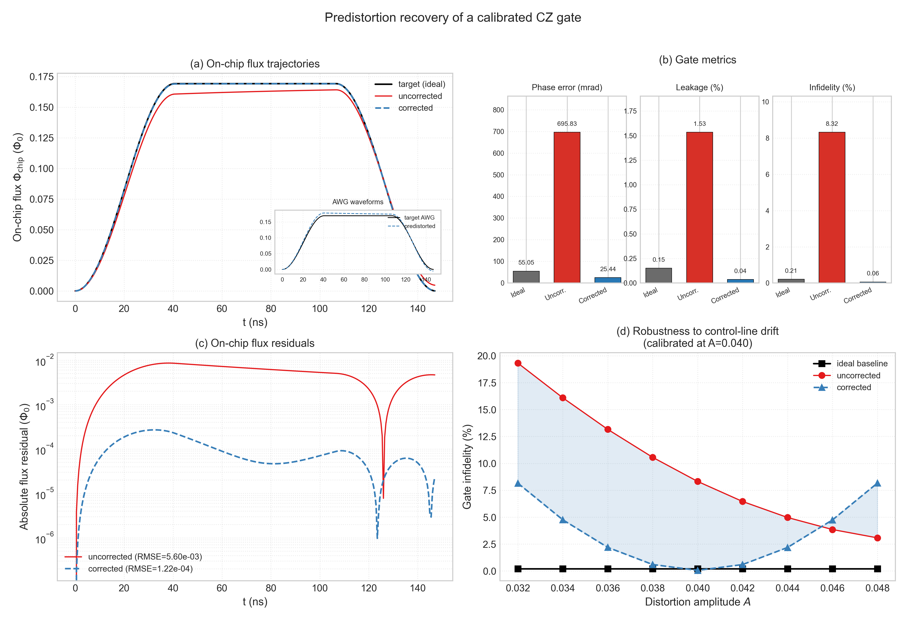

# P7 - Predistortion impact on a calibrated CZ gate

The ideal-line CZ pulse is calibrated once and then frozen. The same pulse is
used for ideal, uncorrected, and predistortion-corrected control lines.



## Figure content

- **(a) On-chip flux:** target, uncorrected response, corrected response, and
  the predistorted AWG waveform.
- **(b) Gate metrics:** phase error, leakage, and infidelity use separate axes
  and physical units; no multiple-y-axis overlay is used.
- **(c) Flux residual:** correction reduces waveform RMSE by about 46x.
- **(d) Drift robustness:** the inverse is frozen at A=0.040 while the dominant
  control-line amplitude drifts from 0.032 to 0.048.

## Frozen result

| Metric | Ideal line | Uncorrected | Corrected |
|---|---:|---:|---:|
| Conditional phase (rad) | 3.0865 | 2.4458 | 3.1162 |
| Phase error (mrad) | 55.05 | 695.83 | 25.44 |
| Leakage (%) | 0.15 | 1.53 | 0.04 |
| Infidelity (%) | 0.21 | 8.32 | 0.06 |
| Flux RMSE (Phi0) | - | 5.60e-3 | 1.22e-4 |

The corrected result is slightly better than the sampled ideal-line pulse for
phase error and leakage. This is not reported as a fundamental improvement:
the residual line response happens to move the discretized pulse closer to the
CZ optimum. The supported claim is recovery to the calibrated baseline.

## Gate model corrections

- Both qubits now use one common rotating frame, so their static detuning is
  preserved.
- The projected average fidelity uses
  `(abs(Tr(U_target^dag M))^2 + Tr(M^dag M)) / (d(d+1))`, which correctly
  includes leakage for the non-unitary computational-subspace map `M`.
- Computational basis columns are mapped correctly in both propagator and
  trajectory modes.

## Frozen pulse and line

| Parameter | Value |
|---|---:|
| Q2 static flux bias | 0.216678 Phi0 |
| CZ amplitude | 0.169178 Phi0 |
| CZ duration | 147.323 ns |
| Rise/fall fraction | 0.276177 |
| Coupling | 0.05 GHz |
| True line model | A=[0.04, 0.02], tau=[80, 400] ns |
| Cryoscope fit | A=0.05721, tau=128.49 ns |

`cz_gate_impact_sqc.npz` stores all waveforms, gate metrics, and drift-scan
arrays. `cz_gate_impact_metrics.json` records the frozen configuration and
environment.

Regenerate with:

```bash
python result_sqc/predistortion/P7_cz_gate_impact/generate_cz_gate_impact_sqc.py --recompute
```
